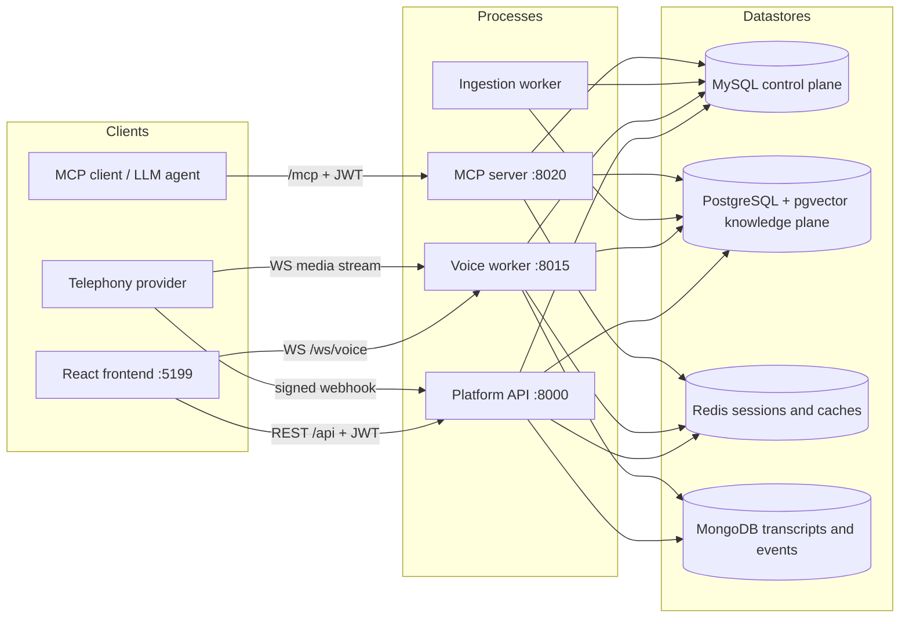
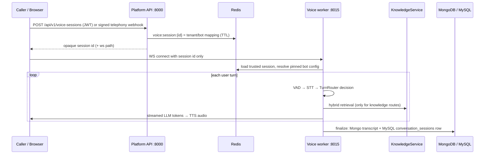

# EchoSphere Architecture

EchoSphere is a multi-tenant voice-bot platform. One codebase produces five runnable
processes that share four datastores. The control plane (tenants, bots, users, config)
lives in MySQL; the knowledge plane (documents, chunks, embeddings) lives in PostgreSQL
with pgvector; conversation transcripts live in MongoDB; live call/session state and
caches live in Redis.

## Processes

| Process | Entry point | Port | Run command |
|---|---|---|---|
| Platform API | `backend/main.py` | 8000 | `env/bin/uvicorn backend.main:app --port 8000` |
| Voice worker | `backend/voice_worker.py` | 8015 | `env/bin/uvicorn backend.voice_worker:app --port 8015` |
| Ingestion worker | `backend/workers/ingestion.py` | — | `env/bin/python -m backend.workers.ingestion` |
| MCP server | `backend/mcp_server/server.py` | 8020 | `env/bin/uvicorn backend.mcp_server.server:app --port 8020` |
| Frontend (dev) | Vite (`vite.config.ts`) | 5199 | `npm run dev` (proxies `/api` → 8000) |

- API docs: `http://localhost:8000/api/docs`. Liveness: `GET /api/health`.
  Readiness: `GET /api/health/ready` — checks MySQL, PostgreSQL (+pgvector), Redis and
  MongoDB (`backend/main.py`).
- The voice worker exposes `GET /health` plus two WebSocket endpoints:
  `/ws/voice/{session_id}` (browser test client) and
  `/ws/telephony/{provider}/{session_id}` (twilio | telnyx | plivo | exotel | freeswitch).
- The MCP server serves streamable-HTTP MCP at `/mcp` behind JWT bearer auth, plus
  `GET /health`. It can also run as `env/bin/python -m backend.mcp_server.server`.

## Component diagram



## Data ownership

| Store | Owns | Access layer |
|---|---|---|
| MySQL (`voice_bot`) | 39+ control-plane tables: users, roles, tenants, voice_bots, `voice_bot_settings` (incl. per-bot STT/TTS/LLM provider columns), `knowledge_sources`, prompts, intents, workflows, `phone_numbers`, `conversation_sessions`, `audit_logs`, … | sync SQLAlchemy, `backend/db/mysql.py`; Alembic `backend/alembic.ini` |
| PostgreSQL (`echosphere_knowledge`) | `knowledge_documents`, `knowledge_chunks` (Vector(1536) + HNSW + FTS GIN), `knowledge_ingestion_jobs`, LangGraph checkpoints | async SQLAlchemy + asyncpg, `backend/db/postgres.py`; Alembic `backend/alembic_pg.ini` (version table `alembic_version_pg`) |
| MongoDB | `conversation_transcripts` (per-turn route/kbSources/latencyMs, events, usage; PII-masked), `voice_events` | Motor, `backend/db/mongo.py` |
| Redis | `voice:session:{id}` trusted session mappings, `botcfg:*` published-config cache, webhook replay keys, MCP rate-limit buckets | `backend/db/redis.py` |

Migrations: `env/bin/python -m backend.cli migrate` (MySQL),
`env/bin/python -m backend.cli pg-migrate` (PostgreSQL). Seeds:
`env/bin/python -m backend.cli seed [--demo]`.

## Key subsystems

- **Voice runtime** (`backend/voice_runtime/`) — Pipecat 1.5 pipeline per call:
  VAD → turn control → STT → `ConversationBrain` → TTS. See
  [VOICE_RUNTIME.md](VOICE_RUNTIME.md).
- **Knowledge plane** (`backend/knowledge/`) — upload validation, background ingestion
  (parse → chunk → embed → store → verify), hybrid retrieval (dense + keyword + RRF).
  See [KNOWLEDGE_AND_RAG.md](KNOWLEDGE_AND_RAG.md) and [PGVECTOR.md](PGVECTOR.md).
- **Providers** (`backend/providers/`) — pluggable STT/TTS/LLM registry
  (`backend/providers/factory.py`), selected per bot via `voice_bot_settings`
  columns with env defaults as fallback.
- **Orchestration** (`backend/orchestration/`) — `TurnRouter` (per-utterance routing)
  and the LangGraph `WorkflowEngine` for stateful multi-step flows. See
  [WORKFLOWS.md](WORKFLOWS.md).
- **Telephony** (`backend/telephony/`) — signed inbound webhooks, provider connect
  payloads, media serializers, FreeSWITCH ESL client. See [TELEPHONY.md](TELEPHONY.md).
- **MCP server** (`backend/mcp_server/`) — tenant-scoped knowledge tools for external
  agents. See [MCP_TOOLS.md](MCP_TOOLS.md).

## A call, end to end



The security model that underpins every arrow above — server-side tenant resolution,
the single KB-authorization choke point, sanitized 404s — is described in
[MULTI_TENANCY.md](MULTI_TENANCY.md) and [SECURITY.md](SECURITY.md).

## Repository layout (backend)

```
backend/
  main.py             Platform API app factory + health/readiness
  voice_worker.py     Realtime call host (WebSockets, Pipecat runner)
  mcp_server/         Streamable-HTTP MCP server + JWT middleware
  workers/ingestion.py  Job-queue poller (FOR UPDATE SKIP LOCKED)
  cli.py              migrate / pg-migrate / seed
  config.py           Pydantic settings, env-driven; secret references (env:VAR)
  db/                 mysql.py, postgres.py, mongo.py, redis.py
  models/             MySQL ORM (control plane)
  knowledge/          models, service, ingestion/, parsing/, chunking/,
                      retrieval/, vector_store/, embeddings/, security.py
  voice_runtime/      pipeline.py, brain.py, services.py, session.py,
                      bot_config.py, serializer.py, audio/
  orchestration/      router.py (TurnRouter), workflow_engine.py (LangGraph)
  providers/          stt/, tts/, llm/ + factory registry
  telephony/          webhooks.py, providers.py, freeswitch.py
  routers/            REST API (/api/v1/*)
  alembic/ alembic_pg/  MySQL and PostgreSQL migration environments
  tests/              unit/, integration/, perf/
```

The legacy `VoiceBot/` folder was removed on this branch; its usable parts were ported
into `backend/`. See [MIGRATION_FROM_VOICEBOT.md](MIGRATION_FROM_VOICEBOT.md).
