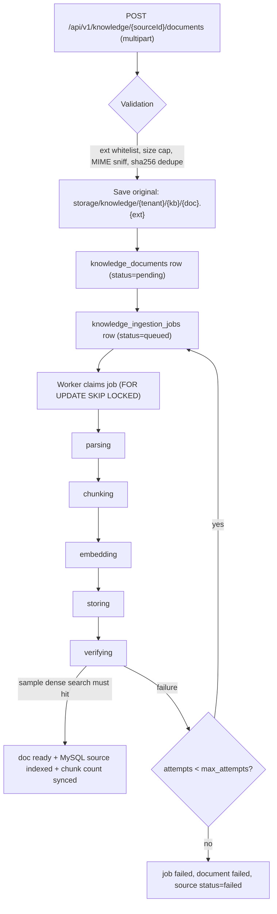
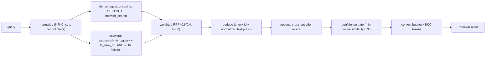

# Knowledge Plane and RAG

The knowledge plane turns uploaded documents into tenant-scoped, retrievable chunks in
PostgreSQL + pgvector, and serves hybrid retrieval to the REST API, the voice runtime
and the MCP server through **one implementation**: `KnowledgeService`
(`shared/knowledge/service.py`).

Control-plane metadata (`knowledge_sources`: name, scope, status, chunk count) stays
in MySQL; document/chunk/job rows live in PostgreSQL (see [PGVECTOR.md](PGVECTOR.md)).

## Upload → indexed

- **Upload validation** (`KnowledgeService.upload_document` + `ingestion/storage.py`):
  extension whitelist (pdf, docx, doc, txt, md, markdown, csv, json, xlsx, xls, pptx,
  ppt), size cap `KNOWLEDGE_MAX_FILE_MB` (default 25), magic-byte MIME sniffing
  (`sniff_mime` rejects content/extension mismatches), per-KB sha256 dedupe (duplicate
  uploads return the existing document with `duplicate: true`).
- **Storage** paths are built only from server-generated ids
  (`storage/knowledge/{tenant|_global}/{kb}/{document_id}.{ext}`) — path-traversal
  safe by construction, plus a resolved-path containment check.
- **Worker** (`env/bin/python -m backend.workers.ingestion`,
  `backend/workers/ingestion.py`): polls every `INGESTION_WORKER_POLL_SECONDS` (2 s),
  claims jobs with `FOR UPDATE SKIP LOCKED` — multiple instances are safe. In-process
  concurrency 2; SIGINT/SIGTERM drain in-flight jobs.
- **Pipeline** (`shared/knowledge/ingestion/pipeline.py`): stage/progress are written
  to the job row (`parsing` 1% → `chunking` 30% → `embedding` 45% → `storing` 75% →
  `verifying` 90% → `done` 100%); each stage checks for cancellation. Retries up to
  `max_attempts` (default `INGESTION_MAX_ATTEMPTS=3`), then the document and the MySQL
  source are marked failed. Verification runs a real dense search with the first
  chunk's embedding — a document is never `ready` unless it is actually retrievable.

Lifecycle endpoints (`backend/routers/knowledge_documents.py`): status, retry, cancel,
`reindex` (old chunks stay searchable until the new run replaces them; upsert keyed by
`(document_id, chunk_index)`), delete (soft-archive of chunks + document).

## Parsing and chunking

`shared/knowledge/parsing/loader.py` (ported from KMRAG, blocking — always run via
`asyncio.to_thread`):

- **PDF/PPTX**: PyMuPDF layout-aware extraction with table detection, heading
  detection and repeated header/footer stripping; page-aware chunking stamps
  `page_number` on every chunk.
- **OCR fallback**: pages under `OCR_MIN_PAGE_CHARS` go through pytesseract when
  `ENABLE_OCR_FALLBACK=true`, with optional GPT-vision escalation
  (`shared/knowledge/parsing/ocr.py`).
- **Other loaders**: docx, xlsx, csv, json, txt, md (markdown keeps raw headings so
  chunking can split on them).

Chunking (`shared/knowledge/chunking/`): document-aware — markdown header-aware
splitting, tables converted to natural-language statements and kept atomic (large
tables split row-batch-wise), token-aware sizing via tiktoken (~512 tokens with
overlap), heading + body kept together, undersized fragments merged into neighbors
(`structured_chunker.py`).

**Prompt-injection flags** are computed per chunk at ingest
(`detect_prompt_injection`, `shared/knowledge/security.py`) and stored in chunk
meta; retrieval sanitizes content before it enters a prompt (`sanitize_for_context`).

## Retrieval

`HybridRetriever` (`shared/knowledge/retrieval/retriever.py`):

- Dense and keyword searches run **in parallel** (`asyncio.gather`) against
  `PgVectorStore` with the authorized KB list and a second tenant filter in SQL.
- The confidence gate keeps chunks whose raw cosine similarity ≥
  `RETRIEVAL_MIN_SCORE` (0.35) **or** that were genuine keyword hits; overall
  `answerable` requires the top set to clear the threshold.
- Reranking (`RETRIEVAL_USE_RERANKER=true`) uses a lazily-loaded sentence-transformers
  cross-encoder and fails open to the fused order
  (`shared/knowledge/retrieval/reranker.py`).
- Result shape (`shared/knowledge/schemas.py`): `RetrievalResult{
  used_knowledge_base, answerable, confidence, query, kb_ids,
  sources[kb_id, document_id, chunk_id, page, section, score, text], duration_ms,
  skipped_reason}`. Raw embeddings never leave the store.

Tuning knobs (env, `shared/config.py`): `RETRIEVAL_TOP_K=6`,
`RETRIEVAL_CANDIDATE_K=24`, `RETRIEVAL_RERANK_K=12`, `RETRIEVAL_MIN_SCORE=0.35`,
`RETRIEVAL_HYBRID_VECTOR_WEIGHT=0.6`, `RETRIEVAL_HYBRID_KEYWORD_WEIGHT=0.4`,
`RETRIEVAL_TS_CONFIG=english`.

## KB selection modes and authorization

`RetrievalRequest.kb_ids` accepts three modes (normalization is in the schema
validator; a single string becomes a list, lists are deduped):

1. `[one id]` — search one KB;
2. `[several ids]` — search a deduped set;
3. `None` — search **all** KBs the caller is authorized for.

Authorization is a single choke point: `KnowledgeService.authorize_kb_ids` checks the
MySQL `knowledge_sources` rows (ownership by `tenant_id` or `scope=global`, not
deleted, status `indexed`/`stale` for search). Any missing, foreign or deleted id in
an explicit request raises a sanitized 404 (`NotFoundError`) without revealing which
id failed. `PgVectorStore` then applies a second tenant filter inside every SQL
statement (defense in depth). Details in [MULTI_TENANCY.md](MULTI_TENANCY.md).

## Embeddings

`shared/knowledge/embeddings/` — provider chosen by `EMBEDDING_PROVIDER`:

- `openai`: `text-embedding-3-small` (dimension 1536), batched at
  `EMBEDDING_BATCH_SIZE=64`, dimension enforced at write time.
- `mock`: deterministic hash-based vectors for development and tests — the whole
  plane works offline with no external keys.

## Consumers

- REST: `POST /api/v1/knowledge/{sourceId}/documents` (upload),
  `POST /api/v1/knowledge/search-test` (studio retrieval testing — same service the
  voice bot uses).
- Voice runtime: `ConversationBrain` calls `KnowledgeService.search` directly.
- MCP: `search_knowledge` et al. (see [MCP_TOOLS.md](MCP_TOOLS.md)).
