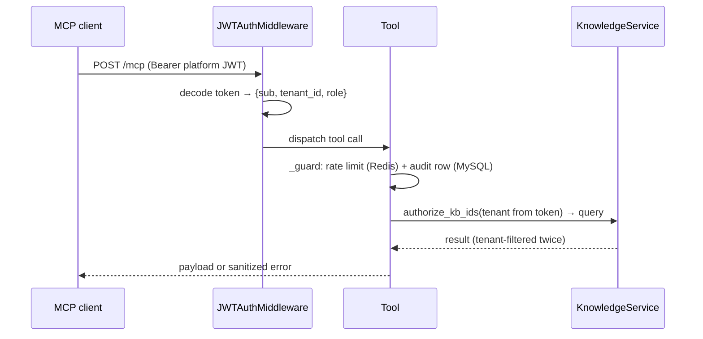

# MCP Server (Knowledge Tools)

`backend/mcp_server/server.py` exposes the knowledge plane to external agents over the
Model Context Protocol (streamable HTTP, endpoint `/mcp`). It is a thin, hardened
facade over the same `KnowledgeService` the REST API and voice runtime use.

Run (either form):

```bash
env/bin/uvicorn backend.mcp_server.server:app --port 8020
env/bin/python -m backend.mcp_server.server        # honors MCP_HOST/MCP_PORT; refuses to start if MCP_ENABLED=false
```

Health: `GET http://localhost:8020/health` (reports Postgres/pgvector status,
no auth required).

> The voice runtime does **not** go through this server — `ConversationBrain` calls
> `KnowledgeService` in-process. MCP exists for external agents/tooling.

## Authentication and tenancy

Every request must carry `Authorization: Bearer <platform JWT>` — the same tokens the
REST API issues (`POST /api/v1/auth/login`). `JWTAuthMiddleware` validates the token
and stashes `{sub, tenant_id, role}` in a request-scoped contextvar; **tenant identity
comes from the verified token, never from tool arguments**. Super-admin tokens (no
`tenant_id`) get platform scope: global KBs only. Every tool call flows through
`KnowledgeService.authorize_kb_ids`, so cross-tenant access is impossible by
construction (see [MULTI_TENANCY.md](MULTI_TENANCY.md)).



## Guard rails (every tool)

- **Rate limit**: 60 calls/minute per tenant, Redis bucket
  `mcp:rate:{tenant}:{minute}`; exceeding returns a `request_error` with
  "Rate limit exceeded". A Redis outage logs a warning and does not block calls.
- **Audit**: each call writes a MySQL `audit_logs` row with `action="mcp.<tool>"`,
  actor `mcp`, and the kb/document id involved.
- **Timeout**: 20 s per operation (`asyncio.wait_for`).
- **Sanitized errors**: exceptions leave the server only as
  `{"error": "not_found" | "request_error" | "timeout" | "internal", "message": ...}`
  — no SQL, paths or stack details.

## Tools

### `list_authorized_knowledge_bases()`
Lists the KBs the authenticated tenant may search (own + global, not deleted).
Returns `{knowledge_bases: [{kb_id, name, type, scope, status, chunks}]}`.

### `search_knowledge(query, kb_id=None, top_k=6)`
Hybrid retrieval over authorized KBs.

- `query`: non-empty string (422 otherwise).
- `kb_id`: one id (`str`), a list of ids, or `None` = all authorized KBs — the three
  retrieval modes. Unknown/foreign/deleted ids → `not_found`.
- `top_k`: 1–20 (422 otherwise).

Returns the full `RetrievalResult` (`used_knowledge_base`, `answerable`,
`confidence`, `kb_ids`, `sources[kb_id, document_id, chunk_id, page_number, section,
score, text]`, `duration_ms`, `skipped_reason`). Raw embeddings are never included.

### `get_knowledge_source(kb_id)`
One KB's document list with ingestion statuses (`status`, `stage`, `progress`,
`attempts`, `failure_reason`, `chunk_count`, timestamps). Authorization is checked
before any Postgres read.

### `get_document_context(document_id, chunk_id, window=1)`
Returns a chunk plus its neighbors ordered by `chunk_index` — for citation expansion.
`window` is clamped to 0–3 (422 otherwise). Ownership is enforced through the
document's KB; deleted or non-`active` chunks are excluded.

## Client configuration example

Any streamable-HTTP MCP client works. Example (Claude Code):

```bash
TOKEN=$(curl -s -X POST http://localhost:8000/api/v1/auth/login \
  -H 'Content-Type: application/json' \
  -d '{"email":"priya.sharma@meridianhealth.com","password":"Demo@2026!"}' \
  | python3 -c 'import sys,json; print(json.load(sys.stdin)["data"]["token"])')

claude mcp add --transport http echosphere-knowledge \
  http://localhost:8020/mcp --header "Authorization: Bearer $TOKEN"
```

Note that platform JWTs expire (`ACCESS_TOKEN_EXPIRE_MINUTES`, default 720), so
long-lived clients must refresh the header.

## Tests

Tenant-isolation behavior is covered by
`backend/tests/integration/test_mcp_isolation.py` (5 tests): tenants only list/search
their own KBs, explicit foreign kb_ids return `not_found`, errors stay sanitized.
