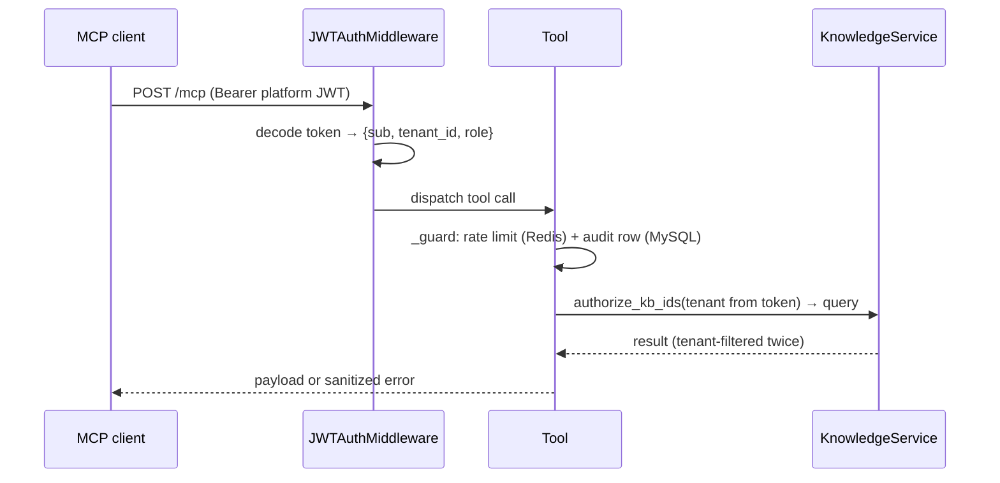

# MCP Server (Knowledge Tools)

`backend/mcp_server/server.py` exposes the knowledge plane to external agents over the
Model Context Protocol (streamable HTTP, endpoint `/mcp`). It is a thin, hardened
facade over the same `KnowledgeService` the REST API and voice runtime use.

Run:

```bash
env/bin/python -m backend.mcp_server.server        # honors MCP_HOST/MCP_PORT; refuses to start if MCP_ENABLED=false
```

Defaults: `MCP_HOST=0.0.0.0`, `MCP_PORT=9003`, `MCP_ENABLED=true`.

Health: `GET http://localhost:9003/health` — no auth required; returns
`{"status": "up", "postgres": <pgvector health>}`.

> The voice runtime does **not** go through this server — `ConversationBrain` calls
> `KnowledgeService` in-process. MCP exists for external agents/tooling.

## Authentication and tenancy

Every request must carry `Authorization: Bearer <platform JWT>` — the same tokens the
REST API issues (`POST /api/v1/auth/login`). `JWTAuthMiddleware` validates the token
and stashes `{sub, tenant_id, role}` in a request-scoped contextvar; **tenant identity
comes from the verified token, never from tool arguments**. Super-admin tokens (no
`tenant_id`) get platform scope: global KBs only. Every tool call flows through
`KnowledgeService.authorize_kb_ids`, so cross-tenant access is impossible by
construction (see [MULTI_TENANCY.md](MULTI_TENANCY.md)).



## Guard rails (every tool)

- **Rate limit**: 60 calls/minute per tenant, Redis bucket
  `mcp:rate:{tenant}:{minute}`; exceeding returns a `request_error` with
  "Rate limit exceeded". A Redis outage logs a warning and does not block calls.
- **Audit**: each call writes a MySQL `audit_logs` row with `action="mcp.<tool>"`,
  actor `mcp`, and the kb/document id involved.
- **Timeout**: 20 s (`asyncio.wait_for`) on the search in `search_knowledge` and
  the document listing in `get_knowledge_source`; a timeout surfaces as
  `{"error": "timeout"}`.
- **Sanitized errors**: exceptions leave the server only as
  `{"error": "not_found" | "request_error" | "timeout" | "internal", "message": ...}`
  — no SQL, paths or stack details.

Tools never raise: any failure comes back as a normal result payload holding the
sanitized `{"error": ..., "message": ...}` dict.

## Tools

### `list_authorized_knowledge_bases()`
Lists the KBs the authenticated tenant may search (own + global, not deleted; any
status). No parameters.

Returns `{"knowledge_bases": [{kb_id, name, type, scope, status, chunks}]}`:

```json
{
  "knowledge_bases": [
    {"kb_id": "<KB_ID>", "name": "Loan FAQs", "type": "document",
     "scope": "bot", "status": "indexed", "chunks": 128}
  ]
}
```

### `search_knowledge(query, kb_id=None, top_k=6)`
Hybrid retrieval over authorized KBs.

| Parameter | Type | Default | Description |
|---|---|---|---|
| `query` | string | — | Required, non-empty (`request_error` otherwise). |
| `kb_id` | string \| string[] \| null | `None` | One id, a list, or `None` = all authorized KBs — the three retrieval modes. Unknown/foreign/deleted ids → `not_found`. |
| `top_k` | int | 6 | 1–20 (`request_error` otherwise). |

Returns the full `RetrievalResult` model dump — raw embeddings are never included:

```json
{
  "used_knowledge_base": true,
  "answerable": true,
  "confidence": 0.8123,
  "query": "What is the late payment fee?",
  "kb_ids": ["<KB_ID>"],
  "sources": [
    {"kb_id": "<KB_ID>", "document_id": "<DOCUMENT_ID>", "chunk_id": "<CHUNK_ID>",
     "chunk_index": 12, "page_number": 3, "section": "Fees", "topic": null,
     "score": 0.8123, "vector_score": 0.79, "keyword_score": 0.31,
     "rerank_score": null, "rank": 1, "passed_gate": true,
     "text": "Late payment fee is ...", "document_name": "faq.pdf", "meta": {}}
  ],
  "duration_ms": 142.5,
  "skipped_reason": null,
  "diagnostics": {"denseCandidates": 24, "keywordCandidates": 9, "afterGate": 6,
                  "minScore": 0.35, "timingsMs": {"embed": 55.1}, "...": "..."}
}
```

### `get_knowledge_source(kb_id)`
One KB's document list with ingestion statuses. Authorization
(`authorize_kb_ids`, any KB status) is checked before any Postgres read.

| Parameter | Type | Default | Description |
|---|---|---|---|
| `kb_id` | string | — | Required. Foreign/unknown ids → `not_found`. |

```json
{
  "kb_id": "<KB_ID>",
  "documents": [
    {"document_id": "<DOCUMENT_ID>", "kb_id": "<KB_ID>", "file_name": "faq.pdf",
     "status": "ready", "stage": "done", "progress": 100.0, "attempts": 1,
     "failure_reason": null, "chunk_count": 42, "page_count": 10,
     "queued_at": "2026-08-01T10:00:00+00:00",
     "started_at": "2026-08-01T10:00:02+00:00",
     "finished_at": "2026-08-01T10:01:12+00:00"}
  ]
}
```

### `get_document_context(document_id, chunk_id, window=1)`
Returns a chunk plus its neighbors ordered by `chunk_index` — for citation
expansion. Ownership is enforced through the document's KB (loaded with the
token's tenant); deleted or non-`active` chunks are excluded.

| Parameter | Type | Default | Description |
|---|---|---|---|
| `document_id` | string | — | Required. Foreign/unknown ids → `not_found`. |
| `chunk_id` | string | — | Required; must belong to the document → `not_found` otherwise. |
| `window` | int | 1 | Neighbors on each side; must be 0–3 (`request_error` otherwise). |

```json
{
  "document_id": "<DOCUMENT_ID>",
  "file_name": "faq.pdf",
  "chunks": [
    {"chunk_id": "<CHUNK_ID>", "chunk_index": 11, "page_number": 3,
     "section": "Fees", "content": "..."},
    {"chunk_id": "<CHUNK_ID>", "chunk_index": 12, "page_number": 3,
     "section": "Fees", "content": "..."},
    {"chunk_id": "<CHUNK_ID>", "chunk_index": 13, "page_number": 3,
     "section": "Fees", "content": "..."}
  ]
}
```

## Client configuration example

Any streamable-HTTP MCP client works. Example (Claude Code):

```bash
TOKEN=$(curl -s -X POST http://localhost:9001/api/v1/auth/login \
  -H 'Content-Type: application/json' \
  -d '{"email":"priya.sharma@meridianhealth.com","password":"Demo@2026!"}' \
  | python3 -c 'import sys,json; print(json.load(sys.stdin)["data"]["token"])')

claude mcp add --transport http echosphere-knowledge \
  http://localhost:9003/mcp --header "Authorization: Bearer $TOKEN"
```

Note that platform JWTs expire (`ACCESS_TOKEN_EXPIRE_MINUTES`, default 720), so
long-lived clients must refresh the header.

## Tests

Tenant-isolation behavior is covered by
`tests/integration/test_mcp_isolation.py` (5 tests): tenants only list/search
their own KBs, explicit foreign kb_ids return `not_found`, errors stay sanitized.
