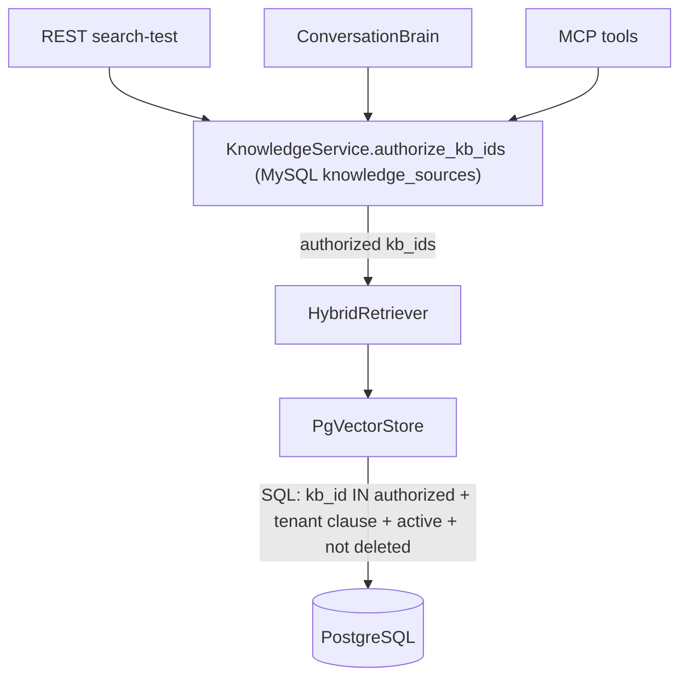

# Multi-Tenancy

EchoSphere is multi-tenant at every layer. The invariants:

1. **Tenant identity is resolved server-side only** — from a verified JWT claim, a
   Redis voice-session mapping, or a phone-number mapping. Request bodies and tool
   arguments never carry trusted tenant identity.
2. **Cross-tenant access always looks like "not found"** — sanitized 404s, never 403s
   that confirm existence.
3. **Knowledge authorization has one choke point**, plus a second tenant filter in
   SQL as defense in depth.

## Where tenant identity comes from

| Entry point | Resolution |
|---|---|
| REST API | JWT claim `tenant_id` (`backend/core/deps.py`); client-supplied tenant ids are honored only for super admins (`resolve_tenant_id`) |
| Voice worker WS | Redis `voice:session:{id}` mapping written by the authenticated API / signed webhook (`backend/voice_runtime/session.py`); the worker additionally verifies the session tenant matches the bot's tenant and closes 4403 on mismatch |
| Telephony webhook | Signed payload → dialed number → MySQL `phone_numbers` (`status='assigned'`) → bot → tenant (`resolve_bot_for_phone_number`) |
| MCP server | JWT bearer token only; middleware stashes `tenant_id` in a contextvar (`backend/mcp_server/server.py`) — tool arguments cannot override it |

Roles: `super_admin` (platform scope, `tenant_id=None`), `tenant_admin`,
`tenant_user`. Platform scope means *global resources only* in the knowledge plane,
not "all tenants' rows" in retrieval.

## Knowledge-base scopes

MySQL `knowledge_sources.scope`:

- `bot` — attached to one bot (still owned by the bot's tenant);
- `tenant` — shared across a tenant's bots;
- `global` — platform-owned (`tenant_id=NULL`), readable by every tenant, creatable
  only by super admins (`backend/routers/knowledge.py`).

`resolve_bot_config` collects a bot's usable KBs as: its own bot-scoped sources +
tenant-scoped sources of its tenant + global sources, restricted to status
`indexed`/`stale` (`backend/voice_runtime/bot_config.py`).

## The authorization choke point

`KnowledgeService.authorize_kb_ids` (`backend/knowledge/service.py`) resolves the
three retrieval modes (single id / list / `None` = all authorized):

- ownership: `tenant_id == caller's tenant` **or** `scope='global'`
  (`include_global`);
- liveness: `is_deleted=false`; searchable statuses are `indexed` and `stale`
  (stale = re-sync pending but still usable);
- any explicitly requested id that is missing, foreign, deleted or archived raises
  `NotFoundError` ("Knowledge base not found") **without revealing which id failed**.

`HybridRetriever.retrieve` only ever receives pre-authorized ids and never touches
authorization itself. `PgVectorStore` then re-applies a tenant clause inside every
statement (`_tenant_clause`): tenant rows + global (`tenant_id IS NULL`) rows for
tenant callers; global rows only for platform scope. A bug above the store therefore
cannot leak cross-tenant chunks.

## Other tenant-scoped surfaces

- **Documents**: `get_document` 404s unless the document belongs to the caller's
  tenant (or is global / caller is super admin); upload requires KB ownership first.
- **Storage**: originals live under `storage/knowledge/{tenant|_global}/{kb}/{doc}` —
  ids are server-generated and each path segment is validated
  (`backend/knowledge/ingestion/storage.py`).
- **Voice sessions**: `POST /api/v1/voice-sessions` asserts bot ownership
  (`assert_tenant_access`) before issuing the session.
- **Bot config cache**: Redis keys are tenant-scoped (`botcfg:{tenant}:{bot}`); the
  per-call snapshot pins tenant identity for the call's lifetime.
- **Transcripts/events**: every Mongo document carries `tenant_id` and `bot_id`;
  conversation listing APIs filter by the JWT tenant.
- **MCP**: per-tenant rate limits and audit rows; errors sanitized (see
  [MCP_TOOLS.md](MCP_TOOLS.md)).
- **Soft delete everywhere**: control plane rows use `is_deleted/deleted_at/
  deleted_by`; hard deletes are blocked while `ALLOW_HARD_DELETE=false`.

## Test coverage

- `backend/tests/integration/test_api_security.py` (13): cross-tenant KB/document
  access via REST returns 404, upload authorization, role enforcement.
- `backend/tests/integration/test_knowledge_service.py` (12): authorize_kb_ids modes,
  foreign/deleted id sanitization, global scope behavior.
- `backend/tests/integration/test_mcp_isolation.py` (5): tenant isolation through the
  MCP tool layer.
- `backend/tests/integration/test_pgvector_store.py` (7): the store-level tenant
  filter (defense in depth) on reads and writes.
