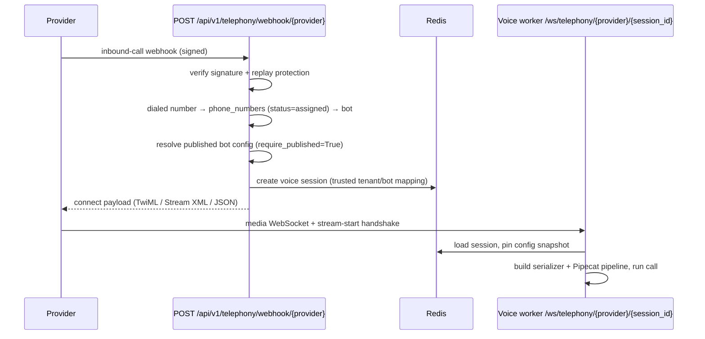

# Telephony Integration

EchoSphere answers inbound calls from five providers — **Twilio, Telnyx, Plivo,
Exotel and FreeSWITCH** (`SUPPORTED_PROVIDERS`, `shared/telephony.py`).
The control flow is: signed webhook → number-to-bot routing → voice session →
provider-specific connect payload → media WebSocket into the voice worker.

External provider accounts are still required for live carrier traffic; the adapters
validate configuration and produce real connect payloads, and provider-mocked tests
cover signatures and routing (`tests/unit/test_webhook_verification.py`).

## Inbound call flow

Implementation: `backend/routers/telephony.py` (webhook),
`voice_runtime/app.py` (`telephony_session`), `shared/telephony.py`
(provider catalog + connect payloads), `voice_runtime/telephony.py`
(media-stream serializers).

## Webhook signature verification

Two schemes (`backend/telephony/webhooks.py`):

| Provider | Scheme |
|---|---|
| Twilio | `X-Twilio-Signature`: HMAC-SHA1 over URL + sorted POST params, base64 (Twilio's documented algorithm), constant-time compare |
| Telnyx / Plivo / Exotel / FreeSWITCH bridges | `X-Webhook-Signature` + `X-Webhook-Timestamp`: HMAC-SHA256 over `<timestamp>.<raw body>`, 300 s max clock skew |

**Replay protection**: accepted signatures are single-use within their validity
window (Redis `SETNX` on `webhook:seen:<sha256(signature)>`). A Redis outage fails
open but logs loudly. The shared secret comes from
`TELEPHONY_WEBHOOK_SECRET_REFERENCE` (an `env:` reference — see
[SECURITY.md](SECURITY.md)); for Twilio the same reference resolves to the account
auth token used in the signature.

## Number → bot routing

The dialed number (`To`/`to`/`CallTo`/`called_number` in the payload) is looked up in
MySQL `phone_numbers` with `status='assigned'`
(`resolve_bot_for_phone_number`, `shared/bot_config.py`). The bot must
have a **published release** (`require_published=True`) — draft bots never answer
carrier traffic. The session created for the call is channel `phone` and records the
caller number (masked before it reaches MySQL).

## Connect payloads

`connect_instructions()` returns what the webhook answers with, pointing the
provider's media stream at
`wss://<public_ws_base>/ws/telephony/{provider}/{session_id}`:

| Provider | Payload |
|---|---|
| Twilio | TwiML `<Response><Connect><Stream url="..."/></Connect></Response>` |
| Plivo | `<Response><Stream keepCallAlive="true" bidirectional="true" contentType="audio/x-l16;rate=8000">…</Stream></Response>` |
| Telnyx | JSON `{"stream_url": ..., "stream_track": "inbound_track"}` (for the TeXML/Call Control handler) |
| Exotel | JSON `{"url": ...}` (Voicebot applet) |
| FreeSWITCH | JSON `{"audio_fork_url": ...}` (consumed by the dialplan helper) |

`public_ws_base` is derived from the webhook request's base URL; it must be a
publicly reachable `wss://` host in production.

## Media WebSocket handshake

`/ws/telephony/{provider}/{session_id}` (`voice_runtime/app.py`):

1. The session id is validated against Redis (unknown/expired → close 4401).
2. For twilio/telnyx/plivo/exotel the worker reads up to 4 JSON messages until the
   provider's stream-start event (`start`/`streamStart`/`media_start`) arrives —
   these serializers need stream identifiers (missing → close 4400).
3. `build_media_serializer()` constructs the Pipecat serializer:
   `TwilioFrameSerializer` (streamSid/callSid), `TelnyxFrameSerializer`
   (stream_id/call_control_id/outbound encoding), `PlivoFrameSerializer`,
   `ExotelFrameSerializer` — or `RawPCMSerializer(input_sample_rate=8000)` for
   FreeSWITCH.
4. The regular voice pipeline runs (see [VOICE_RUNTIME.md](VOICE_RUNTIME.md)); the
   channel recorded on the transcript is the provider name.

## FreeSWITCH

Two integration surfaces (`voice_runtime/freeswitch.py`):

- **Media**: the dialplan attaches `mod_audio_fork` to the worker's
  `/ws/telephony/freeswitch/{session_id}` endpoint — raw L16 @ 8 kHz both ways, no
  JSON handshake, handled by `RawPCMSerializer`.
- **Control**: `ESLClient`, a minimal asyncio Event Socket Layer client (inbound
  mode) implementing `transfer` (`uuid_transfer`), `hangup` (`uuid_kill`),
  `api`, and `health_check`. Configuration: `FREESWITCH_HOST` (default 127.0.0.1),
  `FREESWITCH_PORT` (default 9004), `FREESWITCH_PASSWORD_REFERENCE`
  (`env:FREESWITCH_PASSWORD`). Every operation **fails loudly** when unconfigured or
  rejected (`ProviderError`) — nothing fakes success.

Deployment notes for the ESL socket are in
[DEPLOYMENT.md](DEPLOYMENT.md#4-freeswitch-esl-notes).

## Failure codes (worker WebSocket)

| Close code | Meaning |
|---|---|
| 4400 | invalid/missing stream handshake or serializer config error |
| 4401 | unknown or expired session id |
| 4403 | session tenant does not match bot tenant (defense in depth) |
| 4404 | unknown provider, or bot configuration unavailable |
| 4429 | voice worker at capacity (`VOICE_WORKER_CONCURRENCY`) |
