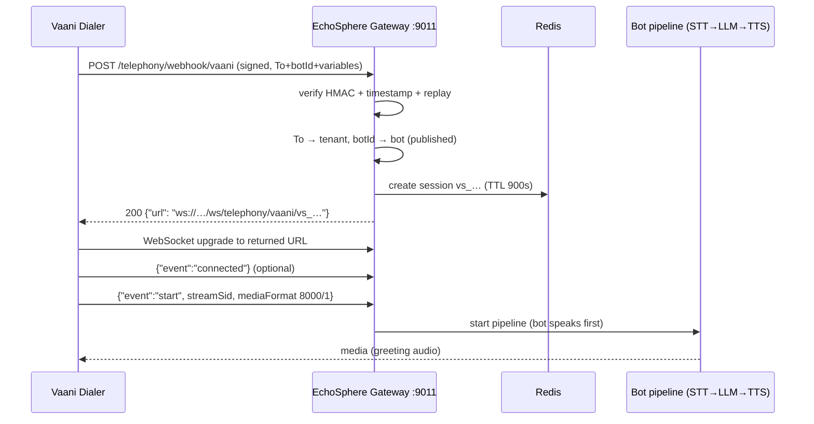
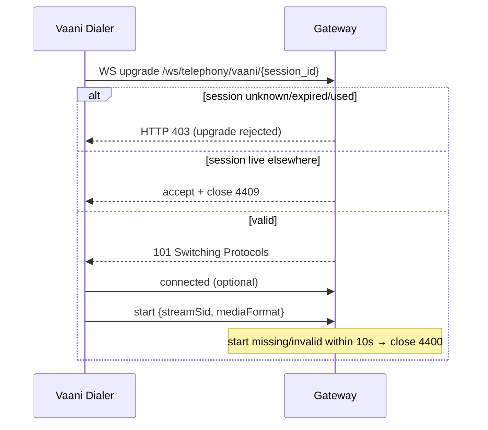
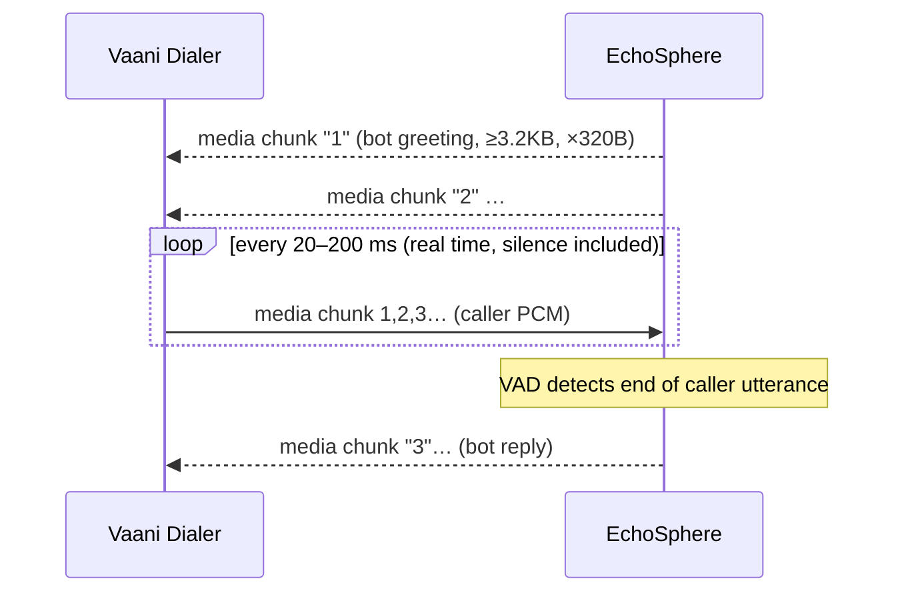
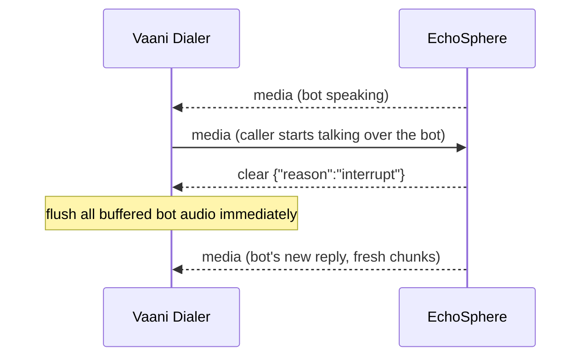
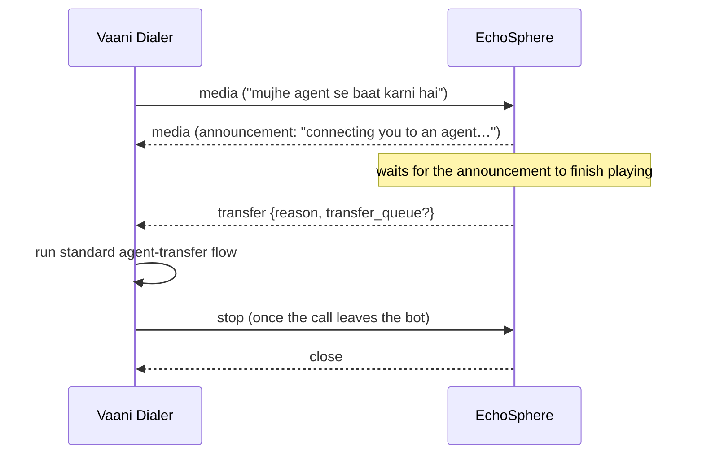
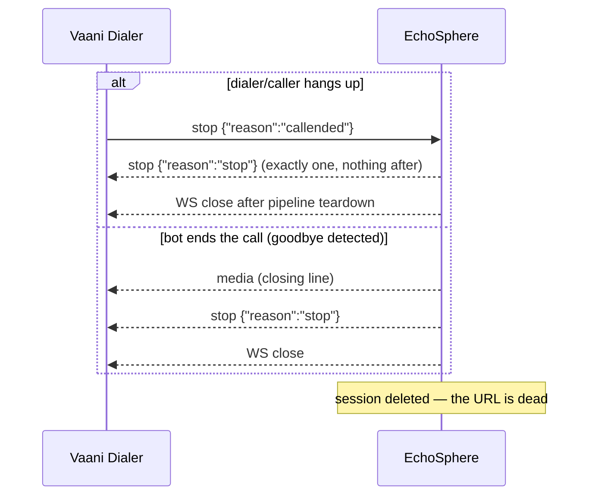

# EchoSphere ↔ Vaani-Telephony Integration Specification

**Audience:** the Vaani / dialer engineering team.
**Status:** verified on 2026-07-29 against the repository, current `.env`,
current routing data, automated integration coverage, and the running gateway.
Examples are representative of the implemented wire contract; identifiers
whose values vary per call are illustrative.

This document is the **authoritative contract**. Where it differs from the
older *"VoiceBOT Integration with Vaani-Telephony Services via WebSocket"* PDF,
this document wins — see [PDF vs Current Implementation](#6-pdf-vs-current-implementation)
for an itemized comparison.

---

## 1. Endpoints

| Purpose | URL |
|---|---|
| Call-setup webhook | `POST http://192.168.60.123:9011/telephony/webhook/vaani` |
| Media WebSocket (returned by the webhook) | `ws://192.168.60.123:9011/ws/telephony/vaani/{session_id}` |
| Liveness (optional monitoring) | `GET http://192.168.60.123:9011/health` |

One host, one port, plain HTTP/WS on the private network. Both endpoints are
served by the same EchoSphere *telephony gateway* process, so no other ports
are needed. (TLS termination in front of the gateway would change only the
schemes to `https://`/`wss://`; the paths stay identical.)

**The WebSocket URL is minted per call.** There is **no static WebSocket
endpoint**: every call MUST begin with the webhook below, and the returned URL
is a short-lived bearer credential for one active call pipeline. The
historical API also mounts the same handler at
`/api/v1/telephony/webhook/vaani` on port 9001, but that is not the Vaani
integration endpoint; Vaani must use the port-9011 URL above.

---

## 2. Call-setup webhook

### 2.1 Request

```
POST /telephony/webhook/vaani HTTP/1.1
Host: 192.168.60.123:9011
Content-Type: application/json
X-Webhook-Timestamp: 1785417437
X-Webhook-Signature: 4b6cb42a…(64 hex chars)…

{ …JSON body, see 2.3… }
```

| Header | Required | Value |
|---|---|---|
| `Content-Type` | yes | `application/json` |
| `X-Webhook-Timestamp` | yes | Unix time in **seconds** at send time. Rejected if it differs from EchoSphere's clock by more than **300 s**. |
| `X-Webhook-Signature` | yes | Lower-case hex HMAC — see 2.2. |
| `Accept` | no | `application/json` recommended. |
| `Authorization` | no | Not used. Authentication is the two HMAC headers above. |

HTTP header names are case-insensitive. Other standard headers such as
`User-Agent`, `Content-Length`, and a dialer-local correlation header are
accepted but ignored by the EchoSphere contract.

### 2.2 Signature generation

```
signature = lowercase_hex( HMAC_SHA256( key = SHARED_SECRET,
                                        msg = "<timestamp>" + "." + <raw request body bytes> ) )
```

* `SHARED_SECRET` is the pre-shared string exchanged out-of-band with the
  EchoSphere team (EchoSphere stores it as `TELEPHONY_WEBHOOK_SECRET`). Never
  put it in the URL or body.
* Sign the **exact raw bytes** you transmit — do not re-serialize the JSON
  after signing.
* **Signatures are single-use.** A signature that was already accepted is
  rejected with `403` ("Webhook replay detected") for 600 s. Because the
  signature is derived from timestamp + body, two calls sent in the **same
  second with an identical body** would collide — always include a unique
  `callId` per call (you should anyway, for tracing).
* `callId` is **not** an idempotency key. Re-signing and resending the same call
  with a fresh timestamp can mint a second session if the first request
  actually succeeded but its response was lost. Serialize setup attempts,
  retain the first successful URL, and do not run blind parallel retries.

Reference implementation (Python):

```python
import hashlib, hmac, json, time

body = json.dumps(payload).encode()
ts   = str(int(time.time()))
sig  = hmac.new(SECRET.encode(), f"{ts}.".encode() + body, hashlib.sha256).hexdigest()
headers = {"X-Webhook-Signature": sig, "X-Webhook-Timestamp": ts,
           "Content-Type": "application/json"}
```

### 2.3 Request body

```json
{
  "To": "+91 80 4522 1010",
  "From": "+919812345678",
  "callId": "VAANI-CALL-8f3a2b",
  "botId": "bot_b97b33667066",
  "variables": {
    "customer_name": "Rohan Sharma",
    "agent_name": "Priya",
    "outstanding_amount": "4500",
    "overdue_days": "12",
    "last_payment_date": "2026-06-30",
    "on_time_repayment_count": "7",
    "dpd_bucket": "8-30"
  }
}
```

| Field | Type | Required | Description |
|---|---|---|---|
| `To` | string | **yes** | The **EchoSphere-mapped phone number** (DID) registered for the tenant — for outbound campaign calls too, send the EchoSphere-mapped number here, **not** the customer's number. It must match the registered number **character-for-character** (including spaces, e.g. `+91 80 4522 1010`). Aliases accepted: `to`, `CallTo`, `called_number`. |
| `From` | string | no | Caller/customer number. Stored (masked) on the call record. Aliases: `from`, `caller_number`. |
| `callId` | string | no | Your call identifier for cross-system tracing (converted to a string and truncated after 64 chars). Aliases: `CallSid`, `call_id`. Strongly recommended and unique per call, but not used for deduplication. |
| `botId` | string | no | Selects which of the tenant's bots answers this call (per-campaign routing over the shared DID). Pattern `^[A-Za-z0-9_-]{1,64}$`. Alias: `bot_id`. Omitted → the DID's default bot. |
| `variables` | object | no | Per-call values passed to the bot as reference context (names, amounts, dates). Max **20** keys; key pattern `[A-Za-z0-9_.-]{1,40}`; values must be scalars (string/number/bool) and are stringified and truncated to **200 chars**. Entries violating the rules are silently dropped, never an error. |

Unknown top-level fields are ignored. `To` and `From` should be strings;
the webhook does not normalize phone numbers or validate E.164 at call time.
`variables: null`, a non-object `variables`, nested values, arrays, and null
values are silently ignored.

**How routing works (identity model):**

* **Tenant** — resolved server-side from `To` via EchoSphere's phone-number
  registry. The payload can never choose a tenant.
* **Bot** — `botId` if present (must belong to that same tenant and have a
  published release), otherwise the number's assigned bot.
* **Campaign** — Vaani-side concept; encode it by configuring the campaign
  with the right `botId` (one bot per DPD bucket for the current tenant) plus
  any campaign fields you want in `variables`.
* **Customer** — `From` + whatever you place in `variables`
  (e.g. `customer_name`). EchoSphere does not look customers up.
* **Call** — `callId` (yours) and `session_id` (EchoSphere's, embedded in the
  returned URL). Quote both in support tickets.
* **Language** — comes from the bot's published configuration (current bots:
  Hindi/Hinglish, `hi-IN`), **not** from the payload.

Do not send `tenantId` as routing authority; it is ignored. Top-level fields
such as `customerId`, `campaignId`, `language`, and arbitrary metadata are also
ignored. Put non-routing campaign/customer values inside `variables`.

Current mPokket campaign routing on the shared DID is:

| Campaign / DPD bucket | `botId` |
|---|---|
| DPD 0–7 (default when `botId` is omitted) | `bot_c2453561ef8c` |
| DPD 8–30 | `bot_b97b33667066` |
| DPD 30–60 | `bot_7ed9c825644f` |
| DPD 60–210+ | `bot_39db9985b7d5` |

All four currently resolve to tenant `tn_22a809aecf66`, are published, and
have `hi-IN` configured. Vaani does not send the tenant id.

### 2.4 Response — success

```
HTTP/1.1 200 OK
Content-Type: application/json

{"url": "ws://192.168.60.123:9011/ws/telephony/vaani/vs_wjHAQFj-8cpCwJmTGI1RyW4V"}
```

| Field | Type | Description |
|---|---|---|
| `url` | string | The media WebSocket URL for **this call only**. The last path segment (`vs_…`, 27 chars) is the session id. Treat the URL as opaque — connect to it exactly as returned. It can host one active call pipeline and expires within **900 s** of issue. |

There is deliberately no success envelope and no separate `sessionId` field.
If the dialer needs the session id for logging, extract the final path segment
from `url`; do not construct or modify the URL.

### 2.5 Response — errors

Error bodies are JSON:
`{"success": false, "message": "<human-readable reason>"}`. Some structured
validation errors may also add an `errors` array.

| HTTP | When | Message (example) |
|---|---|---|
| `403` | Missing/invalid signature headers | `Missing signature headers` / `Invalid webhook signature` |
| `403` | Timestamp beyond ±300 s | `Webhook timestamp outside validity window` |
| `403` | Signature already used | `Webhook replay detected` |
| `403` | Shared secret not configured server-side | `Webhook secret is not configured` |
| `403` | Bot's voice channel disabled by the tenant | `This number is not accepting calls.` |
| `404` | Wrong provider segment in the path | `Unsupported telephony provider '…'` |
| `404` | `To` doesn't match a registered, assigned number | `A bot assignment for this number not found.` |
| `404` | `botId` unknown, archived, or belongs to another tenant (existence is deliberately not revealed) | `Bot not found.` |
| `404` | Selected/default bot has no published release | `Bot has no published release not found.` |
| `422` | No dialed number in the payload | `Webhook payload missing the dialed number` |
| `422` | `botId` fails the pattern | `Invalid botId in webhook payload` |
| `503` | Bot's AI provider disabled under platform governance | `Voice engine unavailable: …` |
| `503` | Control-plane database temporarily unavailable | `The database is temporarily unavailable. Please try again shortly.` |
| `500` | Unexpected server error, including a non-object JSON body | `An unexpected error occurred.` |

There is no "duplicate session" webhook error: each webhook call mints a fresh
session. Duplicate handling happens at the WebSocket layer (close code `4409`,
see 3.3). The Vaani webhook does not normally emit `409`.

---

## 3. Media WebSocket

### 3.1 Connecting

Connect to the returned `url` (standard WebSocket upgrade, no extra headers,
no subprotocol). The session id in the URL **is** the authentication — it was
minted by your signed webhook.

* Connect **within 900 s** of the webhook response (the session expires after
  that; it is also destroyed the moment a call ends).
* **One active call pipeline per session.** After a valid `start` has launched
  the pipeline, a media-socket drop tears it down and deletes the session; it
  cannot be resumed. A failure before the pipeline starts (`4400` or `4429`)
  leaves the Redis session available for a corrected/backoff retry on the same
  URL while its original 900 s TTL remains (see 3.7).
* The current gateway does not require an `Origin` header and
  `PIPECAT_ALLOWED_ORIGINS` is unset. It sends no application-level ping or
  authentication event. Standard WebSocket ping/pong control frames may be
  used by the dialer library.

### 3.2 Handshake — first messages you send

After the upgrade succeeds, EchoSphere reads your first JSON text frames
(up to 4 messages, within **10 s**) looking for the `start` event:

1. `connected` — optional, accepted and ignored.
2. `start` — **required**, carries `streamSid` and the media format:

```json
{"event": "connected", "protocol": "websocket"}
```

```json
{
  "event": "start",
  "streamSid": "MZ9d5d038873d64f39",
  "start": {
    "track": "inbound",
    "streamSid": "MZ9d5d038873d64f39",
    "mediaFormat": {"encoding": "audio/lin", "sampleRate": 8000, "channels": 1}
  }
}
```

Rules:

* `streamSid` is **your** stream identifier; every later event (both
  directions) carries the same value. Missing → close `4400`.
* For the integration contract, `start.mediaFormat` is required:
  `encoding="audio/lin"`, `sampleRate=8000`, `channels=1`. The current code
  validates sample rate and channels when provided (and defaults missing
  values to 8000/1); it does not currently validate `encoding`.
* `start.track` is optional and ignored. The outbound `media.track` is always
  `"inbound"`.
* No `start` within 10 s / 4 messages → close `4400`.
* Invalid JSON or a binary frame during this pre-start window immediately
  fails the handshake with `4400`.

As soon as the `start` is accepted the bot pipeline starts and — because these
are outbound collection campaigns — **the bot speaks first**: expect `media`
events immediately, before you have sent any caller audio.

EchoSphere does **not** send a `connected` acknowledgement. The first
application message from EchoSphere will normally be bot `media`.

### 3.3 WebSocket close codes

| Code | Meaning | What you should do |
|---|---|---|
| `4401` (often surfaced as HTTP `403` because rejection is before `accept`) | Session id unknown or expired | New webhook → new URL |
| `4400` | Bad/missing `start` handshake, or invalid `mediaFormat` | Fix it and reconnect to the same URL within the original TTL |
| `4403` | Internal tenant/bot safety check failed | Report to EchoSphere with session id |
| `4404` | Unknown provider path or bot configuration could not be loaded | Report to EchoSphere |
| `4409` | A live connection already exists for this session (duplicate) | Do not retry this URL; the original connection continues |
| `4429` | Voice worker at capacity before the call pipeline was claimed | Back off and retry the same URL while its original TTL remains; use a fresh webhook only after expiry |
| `4500` | Voice engine configuration error | Report to EchoSphere |
| `1000/1001` | Normal closure after call end | Nothing |

Pre-accept close codes can appear to some WebSocket libraries as a failed HTTP
upgrade rather than a received WebSocket close frame. Treat either form as a
failed connection and log the HTTP status/close code plus session id.

### 3.4 Events: Vaani → EchoSphere

| Event | Required | Notes |
|---|---|---|
| `connected` | no | Ignored safely. |
| `start` | **yes** | See 3.2. Duplicate `start` events are ignored. |
| `media` | yes (caller audio) | See below. |
| `stop` | on hangup | Ends the call server-side even if the socket stays open. |
| `mark` / `marker` | unsupported | Ignored; there is no playback-marker acknowledgement. |
| `clear` | unsupported inbound | Ignored. `clear` is an EchoSphere→Vaani command only. |
| `transfer` | unsupported inbound | Ignored. `transfer` is an EchoSphere→Vaani command only. |
| `dtmf` | unsupported | Ignored; DTMF digits are not currently processed. |
| `error` | unsupported inbound | Ignored. Report transport failures by closing the socket and through operational logs. |
| `hangup` | unsupported | Ignored. Use `stop` for a telephony hangup. |
| any other event | unsupported | Ignored safely after the start handshake; no application error is returned. |

`media` (caller audio):

```json
{
  "event": "media",
  "streamSid": "MZ9d5d038873d64f39",
  "media": {
    "chunk": 1,
    "timestamp": "1785417438",
    "payload": "<base64 of raw 8 kHz 16-bit LE mono PCM>"
  }
}
```

* `chunk` — sequential number starting at 1 (string or integer both accepted).
  A chunk whose number is **not greater** than the last accepted one is
  treated as a retry/duplicate and dropped (protects against doubled audio).
  Sequence gaps are accepted. A non-numeric chunk is accepted but disables
  duplicate protection for that event, so do not use one.
* `timestamp` — send epoch seconds to match the PDF and outbound contract.
  EchoSphere currently ignores this field; millisecond timestamps are also
  tolerated but should not be relied on.
* `payload` — base64 of **raw PCM**: 8000 Hz, 16-bit signed little-endian,
  mono, **no WAV header**. The current guard drops base64 strings longer than
  140,000 characters (intended to bound raw audio to approximately 100 KB).
  For the dialer contract, keep decoded audio at or below 100,000 bytes.
  Malformed base64 / undecodable JSON is dropped silently.
* Send caller audio **continuously in real time**, including silence frames —
  EchoSphere's voice-activity detection derives end-of-utterance from the
  audio stream. 20 ms (320-byte) to 200 ms (3,200-byte) cadence works well.
* `streamSid` is required by this contract and must match the start event.
  The implementation drops a different non-empty id; omission happens to be
  tolerated after start but must not be relied on.

JSON text `media` events are the supported Vaani contract. The serializer also
accepts post-handshake binary frames as raw 8 kHz PCM, but that path bypasses
`streamSid`, sequence, and base64 size checks and must not be used by Vaani.

`stop` (dialer hangup):

```json
{"event": "stop", "streamSid": "MZ9d5d038873d64f39", "stop": {"reason": "callended"}}
```

The `stop.reason` value is currently ignored; any `stop` event for the active
`streamSid` ends the worker.

For protocol-compatibility testing only, these are realistic DTMF and marker
frames. EchoSphere currently ignores both and sends no acknowledgement:

```json
{"event": "dtmf", "streamSid": "MZ9d5d038873d64f39", "dtmf": {"digit": "5", "duration": 120}}
```

```json
{"event": "mark", "streamSid": "MZ9d5d038873d64f39", "mark": {"name": "played-1"}}
```

The spelling `marker` with a `marker` object is ignored in the same way.
An inbound `hangup` or `error` object is also ignored; use `stop` to terminate
the call and operational logging/connection close to report a transport error.

### 3.5 Events: EchoSphere → Vaani

| Event | Meaning |
|---|---|
| `media` | Bot audio to play to the caller |
| `clear` | Caller barged in — **immediately flush/stop playback** of buffered bot audio |
| `transfer` | Hand the call to a live agent |
| `stop` | Call ended by the bot/platform — exactly **one** is ever sent, and nothing follows it |

`media` (bot audio):

```json
{
  "event": "media",
  "streamSid": "MZ9d5d038873d64f39",
  "media": {
    "track": "inbound",
    "chunk": "1",
    "timestamp": "1785417439",
    "payload": "<base64 PCM, same format as inbound>"
  }
}
```

Outbound chunk guarantees (per the platform playback guidance):
* size is always a **multiple of 320 bytes** (zero-padded when needed),
* at least **3,200 bytes** in steady state — except the final flush of an
  utterance, and the first packets of each utterance, which ramp up from
  **640 → 1,280 → 2,560 bytes** so the bot's first audio arrives sooner
  (all still 320-byte aligned),
* never more than the nominal **100,000-byte** limit (the largest aligned
  regular chunk produced by the current code is 99,840 bytes),
* `chunk` is a sequential **string** counter, `timestamp` is epoch **seconds**.

`clear` (barge-in):

```json
{"event": "clear", "streamSid": "MZ9d5d038873d64f39", "clear": {"reason": "interrupt"}}
```

Sent the moment the caller starts talking over the bot. Any bot `media` you
have buffered but not yet played **must be discarded**; new `media` for the
bot's next reply will follow.

`transfer` (agent handoff — from an escalation intent, an explicit caller
request, or a workflow handover step):

```json
{
  "event": "transfer",
  "streamSid": "MZ9d5d038873d64f39",
  "transfer": {
    "reason": "workflow_handover",
    "transfer_queue": "collections_queue_1"
  }
}
```

* `reason` — always present. Current values include
  `explicit_transfer_request`, `transfer_in_workflow`, `handoff_phrase`,
  `intent_handoff`, `workflow_handover`, and the generic `transfer` fallback.
  Treat it as an open label for logging, not an enum.
* `transfer_queue` — present when the bot's workflow specifies a destination
  queue; route on it if present.
* `agent_id` — reserved in the schema; not currently emitted.
* **Timing:** the transfer event is deliberately sent **after** the bot has
  finished speaking its announcement ("connecting you to an agent…"), so you
  may execute the transfer immediately on receipt.

`stop`:

```json
{"event": "stop", "streamSid": "MZ9d5d038873d64f39", "stop": {"reason": "stop"}}
```

After `stop`, EchoSphere sends nothing else and closes the socket (allow up
to the dialer's normal call-teardown timeout for the pipeline to drain).

EchoSphere sends no `connected`, `mark`/`marker`, `dtmf`, transcript, bot-text,
or application-level `error` events on the Vaani socket. Provider failures are
handled internally where possible; fatal setup failures use close codes.

### 3.6 Audio contract

| Property | Vaani → EchoSphere | EchoSphere → Vaani |
|---|---|---|
| Container | Raw audio bytes, no WAV/RIFF header | Raw audio bytes, no WAV/RIFF header |
| Encoding | Signed linear PCM (`audio/lin`), 16-bit little-endian; **not** G.711 μ-law/A-law | Same |
| Sample rate | 8,000 samples/s | 8,000 samples/s |
| Channels | 1 (mono) | 1 (mono) |
| JSON transport | Standard base64 in `media.payload`; no data-URI prefix | Same |
| Frame quantum | Use multiples of 320 bytes = 160 samples = 20 ms | Always emitted on 320-byte boundaries |
| Recommended packet | 320 bytes every 20 ms, or a paced multiple up to 3,200 bytes | Normally buffered to at least 3,200 bytes; the first packets of an utterance ramp up from 640 bytes and the final utterance chunk may be shorter |
| Maximum | Contract maximum 100,000 decoded bytes | 99,840 bytes effective aligned maximum |

At 8 kHz × 16-bit × mono, the stream is 16,000 bytes/s. Therefore 320 bytes
is 20 ms and 3,200 bytes is **200 ms**, not approximately 100 ms as stated in
the PDF. Vaani must accept the shorter final bot-audio chunk.

### 3.7 Timeouts, retries, duplicates, disconnects

| Concern | Behavior |
|---|---|
| HMAC clock skew | ±300 s |
| Accepted-signature replay window | 600 s |
| Webhook → WS window | 900 s (session TTL) |
| Handshake deadline | 10 s / 4 messages for `start` |
| Connected transport timeout | **900 s absolute** from pipeline start; EchoSphere records `session_timeout` and cancels the call |
| Pipeline speech-idle monitor | 48 s with the current 12 s setting. If neither caller nor bot is speaking it logs recurring idle warnings, but `cancel_on_idle_timeout=False`, so silence alone does **not** disconnect the call |
| Configured max call duration | 3,600 s, but the 900 s transport timeout currently fires first; effective connected-call ceiling is therefore approximately 900 s |
| Gateway concurrency | 20 active calls; additional sockets close `4429` |
| **Reconnect after an established call drops** | **Not supported on the same URL.** The call pipeline tears down and deletes the session. A replacement call requires a fresh webhook and URL. |
| Retry before pipeline start | `4400`/`4429` do not delete the issued session; fix/back off and retry the same URL within its original TTL |
| Duplicate WS connection | Second connection to a live session → close `4409`; the first connection is unaffected |
| Duplicate/replayed events | Foreign `streamSid` → dropped; non-increasing `media.chunk` → dropped; duplicate `connected`/`start`/`stop` → harmless |
| Dialer hangup | Send `stop` (preferred), or just close the socket — both tear the call down and persist the transcript |
| Bot-side hangup | Caller says goodbye → bot acknowledges → EchoSphere sends `stop` and closes |

Webhook retry and WebSocket reconnect are different:

* An exact webhook replay (same timestamp, body, and signature) is `403`.
* A freshly signed retry can create a new session, but there is no server-side
  `callId` deduplication; if the first response was merely lost, two live
  session URLs can exist.
* A WebSocket media stream is never resumed and live audio is never replayed.
  Before starting a replacement session for the same PSTN call, Vaani should
  ensure the old socket is closed and use only the newest accepted URL.
* The PDF's exponential-backoff guidance applies only to retrying a
  pre-pipeline capacity failure on the still-issued session. It cannot resume
  an established call after the media socket drops.

For graceful dialer termination, send `stop`, stop sending media, continue
reading until EchoSphere's `stop` or socket close, and then release resources.
On an abrupt TCP/WebSocket disconnect EchoSphere cancels the pipeline and
deletes the session, but cannot send a final protocol event over the dead link.

### 3.8 Call state on the EchoSphere side (for support)

Session state lives in Redis (`issued` → `connected` → deleted at call end);
the Redis record contains `session_id`, trusted `tenant_id`/`bot_id`,
`channel="phone"`, `caller`, `call_id`, sanitized `variables`, `created_at`,
and `status`. The gateway also tracks active session ids in process to reject
duplicate sockets.

At teardown, persistence is best-effort and never blocks live audio:

* MongoDB receives the transcript, turns, operational events, usage,
  bot-version snapshot, language, duration, and detailed `end_reason`.
* MySQL receives a summarized conversation row with `status="completed"`,
  masked caller, duration, containment/escalation, and usage rollups.
* The single-use Redis session key is deleted.

There is no call-status callback from EchoSphere to Vaani. When raising an
issue, provide the **session id** (from the WS URL) and your `callId` — both
appear in EchoSphere logs at webhook time.

---

## 4. Sequence diagrams

### 4.1 Successful call setup (outbound campaign)



### 4.2 Webhook authentication and session creation

```mermaid
sequenceDiagram
    participant D as Vaani Dialer
    participant GW as Gateway
    participant R as Redis
    participant DB as MySQL

    D->>D: ts = now(); sig = HMAC_SHA256(secret, ts + "." + body)
    D->>GW: POST body + X-Webhook-Signature + X-Webhook-Timestamp
    GW->>GW: |now-ts| ≤ 300s? constant-time compare
    GW->>R: SETNX seen:sha256(sig)  (single-use)
    alt already seen
        GW-->>D: 403 Webhook replay detected
    end
    GW->>DB: To → phone_numbers → tenant (+ default bot)
    GW->>DB: botId → bot (same tenant, published?)
    alt bot invalid / cross-tenant
        GW-->>D: 404 Bot not found.
    end
    GW->>R: SET voice:session:vs_… {tenant,bot,caller,callId,variables}
    GW-->>D: 200 {"url": …}
```

### 4.3 WebSocket connect + start



### 4.4 Continuous bidirectional audio



### 4.5 Barge-in (caller interrupts the bot)



### 4.6 Transfer to agent



### 4.7 Normal hangup



### 4.8 Failure paths

```mermaid
sequenceDiagram
    participant D as Vaani Dialer
    participant GW as EchoSphere

    D->>GW: POST webhook (bad/missing signature)
    GW-->>D: 403 {"success":false,"message":"Invalid webhook signature"}
    D->>GW: POST webhook (unknown botId / wrong tenant)
    GW-->>D: 404 {"success":false,"message":"Bot not found."}
    D->>GW: WS upgrade with dead session id
    GW-->>D: HTTP 403 (no socket)
    D->>GW: WS + no start within 10s
    GW-->>D: close 4400
    note over D: Pre-pipeline 4400/4429: retry same issued URL; dead established call: new webhook
```

---

## 5. Current deployment and required configuration

### 5.1 Verified current values

| Setting | Current value | Purpose |
|---|---|---|
| `TELEPHONY_GATEWAY_HOST` | `0.0.0.0` | Bind the gateway on all interfaces |
| `TELEPHONY_GATEWAY_PORT` | `9011` | Public HTTP + WebSocket port for Vaani |
| `TELEPHONY_PUBLIC_WS_BASE` | `ws://192.168.60.123:9011` | Prefix used in the webhook's returned `url` |
| `TELEPHONY_WEBHOOK_SECRET_REFERENCE` | `env:TELEPHONY_WEBHOOK_SECRET` | Secret reference used by HMAC verification |
| `TELEPHONY_WEBHOOK_SECRET` | configured (value intentionally omitted) | Shared webhook HMAC secret |
| `VOICE_SESSION_TIMEOUT` | `900` | Redis issuance TTL and absolute connected transport timeout |
| `VOICE_WORKER_CONCURRENCY` | `20` | Maximum active calls in this gateway process |
| `MAX_CALL_DURATION` | `3600` | Secondary duration timer; currently superseded by the 900 s transport timeout |
| `DEFAULT_SILENCE_TIMEOUT` | `12` | Base for the non-terminating 48 s pipeline speech-idle monitor |
| `PIPECAT_ALLOWED_ORIGINS` | unset | No WebSocket Origin allowlist is enforced |

At verification time, all three processes were listening on their configured
ports (API 9001, browser worker 9002, telephony gateway 9011). Both
`http://127.0.0.1:9011/health` and
`http://192.168.60.123:9011/health` returned `200`, gateway status `up`,
and Redis health `ok`.

Run the public dialer gateway with:

```bash
env/bin/python -m voice_runtime.gateway
```

The gateway, API, and other voice worker processes must share the same MySQL
control plane and Redis. Redis is required both to issue/load session bearer
tokens and to record accepted webhook signatures for replay detection. If the
replay-store operation alone fails, the already verified signature is accepted
with a server error log; a wider Redis outage prevents session minting and
therefore prevents a usable call.

Network requirements for the current deployment:

* allow TCP port 9011 from Vaani to `192.168.60.123`;
* preserve WebSocket `Upgrade`/`Connection` if a proxy is introduced;
* keep the exact webhook and WebSocket paths unchanged;
* do not expose the current cleartext HTTP/WS endpoint to an untrusted or
  public network. Add TLS termination and change the configured base to
  `wss://...` before public exposure.

### 5.2 Current configuration observations

The effective wire serializer, not stale channel metadata, is authoritative:

* The assigned DID row currently records provider `freeswitch`, but Vaani
  routing still works because the webhook resolves only the assigned number
  and does not filter on `phone_numbers.provider`. EchoSphere operations
  should correct this metadata to avoid operator confusion.
* The four current campaign bots have no explicit voice `ChannelConfig` row.
  The webhook intentionally treats that legacy condition as implicitly
  enabled; an existing row with `enabled=false` would reject calls with 403.
* Their stored telephony audio setting says `codec="mulaw"` at 8 kHz, but
  `VaaniFrameSerializer` does not use that codec field and sends/receives
  linear PCM16. Vaani must follow §3.6 (PCM16), not the stale `mulaw` metadata.
* The public base is `ws://`, while the PDF calls for `wss://`. This is an
  acknowledged private-network deployment difference, not an accidental URL
  substitution.
* Duplicate-session protection is held in the gateway process's in-memory
  active-session map. The present deployment uses one gateway process. Do not
  place multiple non-sticky gateway workers behind the same returned host
  without adding a distributed session claim, or two simultaneous connections
  could land on different processes.

## 6. PDF vs Current Implementation

The reference PDF (*VoiceBOT Integration with Vaani-Telephony Services via
WebSocket*, eDAS) predates the deployed system. “Not specified” below means
the PDF defines no equivalent contract; Vaani must follow the current
EchoSphere requirement.

### 6.1 Bootstrap, URLs, authentication, and routing fields

| Item / field | PDF specifies | Current code implements | Match? | Compatibility risk / required owner |
|---|---|---|---|---|
| Call bootstrap | Vaani opens a static WebSocket directly | A signed HTTP webhook creates every call session before WebSocket connection | **No** | **Vaani changes:** implement webhook-first setup. |
| Webhook method and URL | Not specified | `POST http://192.168.60.123:9011/telephony/webhook/vaani` | New | **Vaani implements exactly.** Do not use the historical port-9001 API alias. |
| Media WebSocket URL | Example static `wss://<voicebot-url>/stream/voicebot` | Dynamic `ws://192.168.60.123:9011/ws/telephony/vaani/{session_id}`, returned per call | **No** | **Vaani changes:** never construct/cache a static media URL. |
| HTTP `Content-Type` | Not specified | `application/json` | New | **Vaani sends it.** |
| Webhook authentication concept | Mentions a confidential API token but gives no algorithm/header | HMAC-SHA256 shared-secret signature over timestamp + exact raw body | **No** | **Vaani changes:** implement §2.2; no bearer token is accepted. |
| `X-Webhook-Timestamp` | Not specified | Required integer epoch seconds, within ±300 s | New | **Vaani sends it and NTP-syncs hosts.** |
| `X-Webhook-Signature` | Not specified | Required 64-character hex HMAC of `"<timestamp>." + raw_body` | New | **Vaani sends it; EchoSphere owns secret provisioning.** |
| Webhook replay | Not specified | Accepted signature is single-use for 600 s | New | Exact HTTP retry becomes 403. **Vaani must generate unique calls and avoid blind replay.** |
| `To` | Not specified | Required exact assigned DID; anchors tenant and default bot | New | **Vaani sends the EchoSphere DID, not customer MSISDN.** Formatting must match exactly. |
| `From` | Not specified | Optional caller/customer number | New | Vaani should send for traceability; EchoSphere masks it in summaries. |
| `callId` | PDF uses only `streamSid` | Optional provider call id, converted to string and truncated to 64 characters | New | **Vaani should send a unique value**, but must not treat it as server idempotency. |
| `botId` / `bot_id` | Not specified | Optional campaign bot selector, pattern `[A-Za-z0-9_-]{1,64}`; must belong to the DID tenant and be published | New | **Vaani maps campaign→botId.** EchoSphere continues enforcing tenant/publish rules. |
| `variables` | Start-event “call metadata” is mentioned but not defined | Optional object, maximum 20 validated scalar entries, values truncated to 200 characters | New | **Vaani puts customer/campaign metadata here.** Invalid entries are silently discarded. |
| Client-supplied tenant/language | Not specified | Tenant is never client-selected; bot configuration controls initial language | New | Do not send `tenantId` as authority or expect a top-level language override. |
| Success response | Not specified | HTTP 200 JSON `{"url":"ws://.../{session_id}"}` | New | **Vaani parses `url` and connects exactly as returned.** |
| Separate response `sessionId` | Not specified | Not returned; session id is the URL’s final path segment | New | Extract only for logs/support; do not rebuild the URL. |
| WebSocket authentication | Mentions an API token | Opaque issued session id in URL; no extra WS header/subprotocol | **No** | Treat URL as a bearer credential. EchoSphere should add TLS before untrusted/public exposure. |

### 6.2 WebSocket events and message fields

| Event / field | PDF specifies | Current code implements | Match? | Compatibility risk / required owner |
|---|---|---|---|---|
| `connected` direction | Event section says Vaani→VoiceBOT; architecture text says VoiceBOT responds | Optional Vaani→EchoSphere event; accepted and ignored; EchoSphere sends no acknowledgement | PDF inconsistent | **Vaani must not wait for an outbound `connected`.** |
| Handshake window | Not specified | `start` must appear within 10 s and the first four JSON text messages | New | **Vaani sends `start` promptly.** |
| `start.event` | `"start"` | `"start"` (also recognizes generic aliases, but Vaani should not use them) | Yes | None. |
| `streamSid` in `start` | Top-level `streamSid`; examples also use it for later events | Required at top-level or `start.streamSid`; becomes the stream-isolation key | Yes, more tolerant | Vaani sends the same non-empty id on every event. |
| `start.track` | `"inbound/outbound"` placeholder | Ignored; outbound bot media always declares `"inbound"` | Partial | Vaani should send `"inbound"` and must not use this field for routing. |
| `start.mediaFormat.encoding` | `"audio/lin"` | Contract requires it, but current handshake does not validate it | Partial | **Vaani sends `audio/lin`; EchoSphere may add validation later.** |
| `start.mediaFormat.sampleRate` | `8000` | Defaults missing value to 8000; rejects another numeric value | Yes, code lenient | Vaani explicitly sends numeric `8000`. |
| `start.mediaFormat.channels` | `1` | Defaults missing value to 1; rejects another numeric value | Yes, code lenient | Vaani explicitly sends numeric `1`. |
| Vaani→EchoSphere `media` shape | `event`, `streamSid`, `media.chunk`, `timestamp`, `payload` | Same shape | Yes | None. |
| Inbound `media.streamSid` | Same stream id | Foreign non-empty id is dropped; omission is tolerated after start | Partial validation | **Vaani always sends it.** EchoSphere may tighten validation later. |
| Inbound `media.chunk` | Sequential string `1,2,3...` | Numeric string or integer; non-increasing numeric values dropped; gaps accepted | Yes, more tolerant | **Vaani uses increasing numeric values.** Do not replay old audio. |
| Inbound `media.timestamp` | Epoch time example in seconds | Field is currently ignored | Partial | Vaani sends epoch seconds for compatibility; EchoSphere must not use it for ordering today. |
| Inbound `media.payload` | Base64 PCM | Standard base64 decoded to PCM; empty/malformed/over-limit input ignored | Yes | Vaani sends base64 only, with no data-URI prefix. |
| EchoSphere→Vaani `media` shape | `event`, `streamSid`, `media.track/chunk/timestamp/payload` | Identical; track=`inbound`, chunk is sequential string, timestamp is epoch seconds | Yes | Vaani decodes/plays in order. |
| `clear` | Outbound `clear.reason="interrupt"` flushes playback | Identical, emitted on audio-detected barge-in | Yes | **Vaani must immediately discard queued bot audio.** |
| Inbound `clear` | Not defined | Ignored | n/a | Vaani must not use it to control EchoSphere. |
| `transfer.reason` | Present; described as optional explanation | Always present, open string such as `explicit_transfer_request` or `workflow_handover` | Yes | Treat as log label, not closed enum. |
| `transfer.transfer_queue` | Optional queue/skill/direct-agent destination | Optional; forwarded from workflow handoff queue | Yes | **Vaani confirms accepted queue identifiers.** |
| `transfer.agent_id` | Optional | Serializer supports it; current conversation paths do not emit it | Partial | Dialer must tolerate absence; EchoSphere changes only if direct-agent routing is required. |
| Transfer timing | Execute transfer when event arrives | Normally emitted after the bot’s handoff announcement | Compatible | Vaani transfers immediately on receipt, then sends `stop`. |
| Inbound `stop` | Ends call/session | Ends worker even if socket remains open; reason ignored | Yes | Vaani sends on hangup/transfer completion. |
| Outbound `stop` | Either side may terminate | Exactly one; serializer sends nothing afterward, then socket closes | Yes | Vaani stops playback/sending and releases resources. |
| DTMF | Not defined | `dtmf` event ignored | n/a | **Dialer team confirms need.** EchoSphere implementation changes only if required. |
| Marker | Not defined | `mark` and `marker` ignored; no acknowledgement | n/a | Do not depend on playback markers. |
| `hangup` event | Not defined | Ignored; protocol hangup is `stop` | n/a | Vaani sends `stop`. |
| Application `error` event | Not defined | Inbound ignored; EchoSphere sends none; fatal setup uses close codes | n/a | Both sides log HTTP/close failures with call/session ids. |
| Transcript/bot-text event | Overview mentions BOT “audio responses or transcripts” but defines no schema | Vaani serializer sends audio/control only, no transcript messages | Partial | If Vaani needs transcripts, both teams must define a new versioned event. |

### 6.3 Audio, recovery, and security behavior

| Item | PDF specifies | Current code implements | Match? | Compatibility risk / required owner |
|---|---|---|---|---|
| Audio | 8 kHz, 16-bit PCM, mono, base64 | Raw signed PCM16 little-endian, 8 kHz, mono, base64, no WAV header | Yes | Vaani must not send μ-law/A-law despite stale DB metadata. |
| 320-byte unit | Required multiple of 320 | Outbound always aligned; inbound alignment not enforced | Partial | Vaani sends aligned frames; EchoSphere remains tolerant inbound. |
| Minimum chunk | 3.2 KB “≈100 ms”, bidirectional | Outbound buffers to 3,200 bytes in steady state (utterance-start packets ramp from 640 bytes, final flush may be short); inbound accepts 320-byte/20 ms frames | Partial | Vaani accepts short leading/final output. PDF arithmetic is wrong: 3,200 bytes is 200 ms. |
| Maximum chunk | 100 KB | Outbound effective maximum 99,840 aligned bytes; inbound contract cap 100,000 decoded bytes with a 140,000-character base64 guard | Compatible | Keep decoded input ≤100,000 bytes. |
| Barge-in | `clear` flushes ongoing playback | VAD detects caller audio, cancels generation, clears server buffer, sends `clear` | Yes | Vaani must make buffer flush low latency. |
| Reconnect | Exponential backoff | Pre-pipeline `4400`/`4429` may retry the still-issued URL; established call cannot resume and needs a fresh webhook | Partial | **Vaani distinguishes setup retry from call resume.** |
| Failed-message replay | “Log failed messages for replay” | Old/non-increasing media is deliberately dropped; exact webhook replay is 403; fresh webhook retry is not idempotent by `callId` | **No** | **Vaani must not replay live audio or blindly retry setup.** |
| Duplicate WS | Not specified | Concurrent second socket for same active session closes 4409 | New | Vaani keeps only one media socket. |
| Timeouts | Not specified | 900 s issuance TTL and absolute connected transport timeout; 48 s speech-idle monitor does not cancel; configured 3,600 s timer is currently unreachable | New | Dialer plans for effective ~15 minute ceiling; EchoSphere changes timeout wiring if longer calls are required. |
| Transport security | Always `wss://`, port 443 | Current private deployment is `ws://192.168.60.123:9011` | Partial / deployment mismatch | Accept only on trusted LAN; **EchoSphere adds TLS before public exposure.** |
| IP allowlist | Recommends known-IP restriction | No app-level Origin/IP allowlist; network firewall is required | Partial | **EchoSphere/network team restricts source IPs.** |
| Close/error signaling | General graceful error guidance | HTTP status/error JSON before WS; close codes 4400/4401/4403/4404/4409/4429/4500 afterward | New | Vaani implements the code handling in §3.3. |

**Bottom line:** the core WebSocket media/control shapes match the PDF, subject
to the direction, chunking, timeout, and reconnect qualifications above. The
**bootstrap** (signed webhook instead of a static endpoint) and single-use
session behavior are the largest changes the Vaani team must build around.

---

## 7. Sandbox / simulator

A dialer simulator ships in the repo — it exercises the identical endpoints a
real dialer would, with human-readable timestamped logs and no hardcoded
secrets (reads the shared secret from the environment/.env):

```bash
env/bin/python backend/scripts/vaani_dialer_sim.py webhook              # signed webhook only, prints request+response
env/bin/python backend/scripts/vaani_dialer_sim.py webhook --bot bot_b97b33667066
env/bin/python backend/scripts/vaani_dialer_sim.py full-call            # webhook → WS → greeting → caller speech → reply → stop
env/bin/python backend/scripts/vaani_dialer_sim.py full-call --wav caller_8k_mono.wav
env/bin/python backend/scripts/vaani_dialer_sim.py full-call --raw caller_8k_pcm16le.raw
env/bin/python backend/scripts/vaani_dialer_sim.py invalid-signature    # 4 auth negative cases (missing/bad/stale/replayed)
env/bin/python backend/scripts/vaani_dialer_sim.py protocol-events      # send DTMF + mark/marker; prove they are safely ignored
env/bin/python backend/scripts/vaani_dialer_sim.py barge-in             # speak over the greeting, expect `clear`
env/bin/python backend/scripts/vaani_dialer_sim.py transfer             # ask for an agent, expect `transfer`
env/bin/python backend/scripts/vaani_dialer_sim.py negative             # routing + WS negative matrix
env/bin/python backend/scripts/vaani_dialer_sim.py abrupt-disconnect    # drop the socket mid-call, verify server cleanup
```

Useful flags: `--base http://…:9011` (default `http://127.0.0.1:9011`),
`--to`, `--bot`, `--say "<text>"` (caller words via Sarvam TTS),
`--wav <file>` (8 kHz/16-bit/mono preferred; mono WAVs at other rates are
resampled), `--raw <file>` (headerless 8 kHz PCM16 little-endian mono),
`--dtmf-digit <digit>`, and `--no-rewrite` (connect to the returned public URL
as-is instead of rewriting the host to the `--base` host for local runs).

A full end-to-end validation script also exists:
`backend/scripts/vaani_e2e_check.py` (20 assertions, used for release checks).

### 7.1 Automated verification

Run the simulator's offline tests and the gateway's mocked integration suite:

```bash
env/bin/python -m py_compile backend/scripts/vaani_dialer_sim.py
env/bin/python backend/scripts/vaani_dialer_sim.py --help
env/bin/pytest -s -q -m "not integration" \
  tests/unit/test_webhook_verification.py \
  tests/unit/test_providers_and_audio.py::TestVaaniTelephony \
  tests/unit/test_vaani_dialer_sim.py
env/bin/pytest -s -q tests/integration/test_vaani_gateway.py
curl --max-time 4 http://192.168.60.123:9011/health
```

The offline unit selection covers HMAC construction and timestamp validation,
request sanitization, all Vaani serializer events/chunk rules, raw PCM loading,
and simulator URL/command behavior. The service-backed integration suite
covers Redis replay protection plus webhook, session, WebSocket
handshake/media/control, close-code, cleanup, timeout, concurrency, and
persistence paths with mocked voice providers; it does not call paid
STT/LLM/TTS services. Run a simulator call separately only when exercising the
configured live bot providers is intended.

---

## 8. Dialer-team checklist

1. Obtain the shared webhook secret from the EchoSphere team (out-of-band).
2. Implement signature generation exactly as §2.2 (hex, lower-case,
   `"<ts>.<raw body>"`).
3. Before each call: `POST` the signed webhook with `To` = EchoSphere-mapped
   DID, unique `callId`, campaign's `botId`, and `variables`.
4. Connect to the returned `url` within 900 s; send `start` (with `streamSid`
   and `mediaFormat` 8000/1) within 10 s.
5. Stream caller PCM continuously (silence included) as sequential `media`
   chunks; play bot `media` chunks as they arrive.
6. On `clear`: flush buffered bot audio immediately.
7. On `transfer`: run your agent-transfer flow (route on `transfer_queue`
   when present), then send `stop`.
8. On hangup: send `stop`; expect at most one `stop` back, then socket close.
9. Retry the same URL only for a pre-pipeline `4400`/`4429` within its original
   TTL. Never try to resume an established/dead call URL — use a new webhook.
10. NTP-sync the dialer host (signature timestamps have a ±300 s window).
11. Log `callId` + session id (`vs_…`) for every call for joint debugging.

## 9. Open items needing confirmation from the Vaani team

1. **Transfer queue identifiers** — what values does Vaani expect in
   `transfer.transfer_queue`? (EchoSphere currently forwards the queue name
   configured in the bot workflow, e.g. `collections_queue_1` — confirm the
   real queue naming.)
2. **Outbound campaign `To` semantics** — confirm the dialer will send the
   EchoSphere-mapped number in `To` (not the customer MSISDN) and the campaign
   bot in `botId`, per §2.3.
3. **DTMF** — is DTMF input required for any flow? It is currently ignored;
   if needed we will spec an event for it.
4. **`connected` event direction** — the PDF is internally inconsistent:
   its architecture text says VoiceBOT responds with `connected`, while its
   event section shows Vaani sending it. EchoSphere treats Vaani's event as
   optional and sends none. Confirm Vaani will not wait for an acknowledgement.
5. **Network reachability** — confirm the dialer can reach
   `192.168.60.123:9011` (TCP) and whether TLS (`wss://`) is required, which
   would add a proxy in front of the gateway.
6. **Per-call webhook rate** — expected peak calls-per-second, so capacity
   (`4429` behavior) can be tuned.
7. **Call duration** — confirm whether 15 minutes is sufficient. The effective
   connected-call ceiling is currently 900 s despite `MAX_CALL_DURATION=3600`.
8. **Setup retry/idempotency** — confirm how Vaani detects an ambiguous
   webhook outcome. EchoSphere does not currently deduplicate fresh requests
   by `callId`; adding an explicit idempotency key is recommended if automatic
   setup retries are required.

---

*Implementation source of truth: `shared/telephony_webhooks.py` (webhook),
`voice_runtime/app.py` (WebSocket host), `voice_runtime/telephony.py`
(`VaaniFrameSerializer` — wire protocol), `shared/bot_config.py`
(`resolve_bot_for_dialer` — routing), `docs/TELEPHONY.md` (platform-wide
telephony docs). Automated coverage: `tests/integration/test_vaani_gateway.py`,
`tests/unit/test_providers_and_audio.py`, `tests/unit/test_webhook_verification.py`,
and `tests/unit/test_vaani_dialer_sim.py`.*
