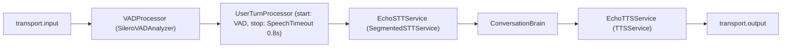

# Voice Runtime

The voice runtime hosts realtime calls in a dedicated process
(`voice_runtime/app.py`, port 8015) built on **Pipecat 1.5**. It is deliberately
separate from the HTTP API: a failure inside one call is contained to that call's
pipeline task, and the API process never blocks on audio.

Run: `env/bin/uvicorn voice_runtime.app:app --port 8015`

## Session issuance (trust boundary)

Clients never tell the voice worker who they are.

1. **Browser**: `POST /api/v1/voice-sessions` (`backend/routers/voice_sessions.py`)
   authenticates the JWT, asserts bot ownership, then writes a trusted
   tenant/bot mapping to Redis (`voice:session:{id}`, TTL = `VOICE_SESSION_TIMEOUT`,
   default 900 s) via `create_voice_session` (`shared/voice_sessions.py`).
   The response carries only the opaque `sessionId` and `wsPath`.
2. **Telephony**: the signed inbound-call webhook issues the session the same way
   (see [TELEPHONY.md](TELEPHONY.md)).
3. The worker (`/ws/voice/{session_id}` or `/ws/telephony/{provider}/{session_id}`)
   loads the mapping with `load_voice_session`; unknown/expired ids are closed with
   code 4401 before any pipeline is built.

Non-browser channels require a **published release**: `resolve_bot_config(...,
require_published=True)` refuses bots without one (`shared/bot_config.py`).
The resolved config snapshot is pinned per call — config edits never mutate an active
call. Snapshots are cached in Redis under `botcfg:*` (TTL 300 s) and invalidated on
voice-settings save (`backend/routers/bots.py`) and release publish/rollback
(`backend/routers/releases.py`).

## Pipeline

Assembled per call by `build_voice_pipeline` (`voice_runtime/pipeline.py`):

- Audio in at 16 kHz, TTS out at 24 kHz (`PipelineParams` in `pipeline.py`).
- `EchoSTTService` / `EchoTTSService` (`voice_runtime/services.py`) wrap the
  shared provider layer (`shared/providers/`) so the realtime pipeline and the REST
  platform use one provider implementation. STT receives VAD-segmented WAV, converts
  via `wav_to_pcm` (`shared/audio/pcm.py`, numpy resampling) and yields
  `TranscriptionFrame`s; TTS streams provider audio chunks as `TTSAudioRawFrame`s.
- Provider failures become `ErrorFrame`s (`stt_failure:*` / `tts_failure:*`), never
  crashes.

## ConversationBrain

`voice_runtime/brain.py` sits between STT and TTS. For every final
transcription it:

1. **Routes** the utterance through `TurnRouter`
   (`shared/orchestration/router.py`) with priority:
   active workflow → call-control (hangup/transfer/repeat/slower) → handoff →
   smalltalk (skips KB) → configured intents (`workflow:` / `tool:` routes) →
   KB-signal heuristics → clarify/chat. A safety rule fires first when a caller
   reads out card numbers/OTPs/passwords.
2. **Retrieves** grounded context for `KNOWLEDGE` routes via `KnowledgeService.search`
   (direct call — no MCP network hop), records a `kb_retrieval` event, and builds a
   grounded prompt that quotes retrieved chunks with numbered citations. Context is
   sanitized (`sanitize_for_context`) and the system prompt instructs the model to
   treat it as data, never instructions. Non-answerable retrievals get an honest
   "I couldn't find that…" fallback with a handoff offer.
3. **Streams** LLM tokens downstream as `TextFrame`s between
   `LLMFullResponseStart/EndFrame`; the TTS service aggregates sentences
   (`shared/audio/text.py` handles sanitizing/sentence splitting,
   Indic-script aware).
4. **Records** `TurnRecord`s (route, kb_sources, latency_ms) and events
   (`route_decision`, `kb_retrieval`, `generation_cancelled`, `handoff`,
   `call_control`) plus usage counters.

**Barge-in**: on `InterruptionFrame` / `UserStartedSpeakingFrame` the brain cancels
its in-flight generation task (retrieval + LLM stream) immediately and flushes a
`generation_cancelled` event. A new transcription also cancels the previous turn.

Conversation history is capped at 20 turns (`_HISTORY_MAX_TURNS`).

## Timeouts and limits

| Limit | Source | Default |
|---|---|---|
| Max call duration | `MAX_CALL_DURATION` → `worker.cancel()` timer in `voice_runtime.app._run_call` | 3600 s |
| Session (transport) timeout | `VOICE_SESSION_TIMEOUT` → `FastAPIWebsocketParams.session_timeout` | 900 s |
| Idle timeout | `silence_timeout * 4` → `PipelineWorker(idle_timeout_secs=...)` | 48 s |
| Worker concurrency | `VOICE_WORKER_CONCURRENCY` (WS closed 4429 at capacity) | 20 |

## Providers

Per-bot selection comes from `voice_bot_settings` columns (migration
`b2e4f6a8c0d2`); `NULL` falls back to env defaults (`STT_PROVIDER`, …). Registry
(`shared/providers/factory.py`, lazy SDK imports, per-config instance cache):

| Kind | Providers |
|---|---|
| STT | `openai`/`whisper` (Whisper API), `deepgram` (httpx REST), `assemblyai` (httpx), `sarvam` (lazy SDK), `mock` |
| TTS | `openai`, `elevenlabs` (httpx), `azure` (lazy), `google` (lazy), `sarvam` (lazy), `mock` |
| LLM | `openai`, `anthropic` (lazy; tools + streaming), `google` (lazy), `mock` |

`GET /api/v1/providers/voice-catalog` exposes the registry (minus mocks) to the
studio UI (`backend/routers/telephony.py`).

## Persistence

`SessionRecorder` (`voice_runtime/recording.py`) accumulates turns/events/usage
in memory; single events that matter operationally (barge-in, handoff, timeouts) are
flushed immediately to Mongo `voice_events`. `finalize()` runs once at call end:

- Mongo `conversation_transcripts` upsert — turns (PII-masked: card/aadhaar/PAN),
  events, usage, bot version.
- MySQL `conversation_sessions` row — duration, channel, containment/escalation,
  caller phone masked.

Neither write is on the audio critical path, and persistence failures never break the
call.

## Browser test protocol

`RawPCMSerializer` (`voice_runtime/serializer.py`): binary WS frames carry raw
16-bit mono PCM (16 kHz in, output rate out); JSON text frames carry side-channel
events (`transcript`, `bot_text`, `bot_speaking_started/stopped`) so the studio
Testing tab (`src/pages/tenant/studio/TestingTab.tsx`) renders live transcripts.
Telephony streams swap in the provider's Pipecat serializer instead
(see [TELEPHONY.md](TELEPHONY.md)).
