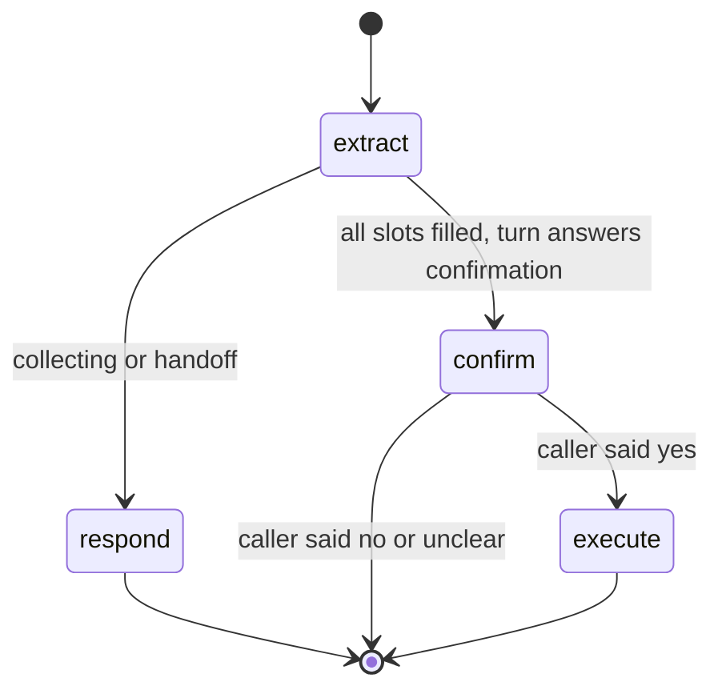

# Workflows (LangGraph)

`shared/orchestration/workflow_engine.py` runs **stateful multi-step business
flows** — slot-filling forms, bookings, escalations — on LangGraph. The scope is
deliberately narrow:

- LangGraph is used **only** for flows that genuinely need persistent state,
  branching, retries and resume-after-restart.
- **Audio never touches LangGraph** — Pipecat owns audio (see
  [VOICE_RUNTIME.md](VOICE_RUNTIME.md)).
- Simple FAQ/KB turns never enter the engine; they are handled by the brain's
  knowledge/chat routes.

## How a call enters a workflow

`TurnRouter` (`shared/orchestration/router.py`) starts a workflow when a configured
intent's route is `workflow:<name>` (e.g. the demo intent "book appointment" →
`workflow:appointment`). While a workflow is active it consumes every subsequent
turn, with two escape hatches that still win: explicit call-control commands and
transfer requests (routed to handoff).

`ConversationBrain._handle_workflow` calls
`WorkflowEngine.handle_turn(session_id, tenant_id, bot_id, workflow_name, user_text)`
which returns `(reply, finished)`; the brain speaks the reply and clears
`_active_workflow` when the flow reports done.

## Reference graph: appointment_booking

Registered names: `appointment_booking` and the alias `appointment`
(`_GRAPH_BUILDERS`). Unknown names currently fall back to the appointment graph.



- **extract**: regex slot extraction over the pending slot. Slots in order:
  `name`, `phone`, `date`, `time` (validation regexes in `_SLOTS`). A failed
  extraction increments `retries`; after 2 re-asks (`_MAX_SLOT_RETRIES`) the flow
  switches to `handoff` and offers a human colleague.
- **respond**: asks the next slot question (with a "Sorry, I didn't catch that."
  prefix on retries) or reads back the full summary for confirmation.
- **confirm**: yes/no matching (`_CONFIRM_YES` / `_CONFIRM_NO`, Hindi `haan`/`nahi`
  included). "No" restarts collection while keeping call identity fields; unclear
  input re-asks.
- **execute**: the external action — idempotent (keyed by session, executed once)
  and audited: an `appointment_booked` entry with tenant/bot/session/slots is
  appended to the state's `audit` trail.

State is the `WorkflowState` TypedDict; every workflow carries the full call
identity (`tenant_id`, `bot_id`, `session_id`) so checkpoints are self-describing.

## Checkpointing

`WorkflowEngine._get_checkpointer()`:

- Primary: **`AsyncPostgresSaver`** (langgraph-checkpoint-postgres) in the
  `echosphere_knowledge` database. `saver.setup()` creates the checkpoint tables on
  first use.
- Thread id: `{session_id}:{workflow_name}` — an in-progress workflow **survives a
  voice-worker restart**; the next turn for the same session resumes from the last
  checkpoint.
- Fallback: if Postgres is unavailable the engine logs the failure and degrades to
  `MemorySaver` (state lost on restart) — calls are never blocked by checkpointing.

## Timeouts and failure containment

`handle_turn` wraps `graph.ainvoke` in a **10 s timeout**; on `TimeoutError` the
caller hears "I'm sorry, that took longer than expected. Let me connect you with an
agent." and the flow is marked finished (handoff). A workflow turn can therefore
never wedge the audio pipeline.

Terminal statuses: `done`, `handoff`, `error` → `finished=True`; anything else keeps
the workflow active for the next turn.

## Adding a workflow

For tenant bots, save a workflow definition through the Studio or
`PUT /api/v1/bots/{bot_id}/workflow`. Its `nodes` and `edges` carry the business
rules. A new tenant, question, API endpoint, language or outcome should not
require another Python graph builder. The engine resolves the saved definition
within the tenant and bot scope. Setup scripts are configuration templates,
not separate runtime implementations.

The Python builders below are legacy platform examples. Use them only when
developing an engine capability that saved definitions cannot express:

1. Write a builder `def build_my_graph(checkpointer) -> CompiledGraph` in
   `workflow_engine.py` (or a new module) using `StateGraph(WorkflowState)`.
2. Register it in `_GRAPH_BUILDERS` under its route name.
3. Route into it: create an intent whose `route` is `workflow:<name>` (MySQL
   `intents` table, managed via `POST /api/v1/bots/{bot_id}/intents` or the studio
   UI). `resolve_bot_config` ships active intents to the router automatically.
4. Keep nodes fast and non-blocking; anything slow belongs behind the 10 s budget or
   in an external job.

## Configuring corrections, comparisons and readbacks

These options are interpreted by the shared engine; none depends on a tenant
or bot ID. Configure them in each node's `config` JSON. They currently have no
dedicated Studio form controls.

| Option | Behavior |
| --- | --- |
| `alsoCapture[].invalidateSlots` | Clear listed dependent slots when that capture changes value or explicitly clears its own slot. Later explicit captures in the same utterance may refill them. Put premise fields before dependent fields. |
| Condition `valueVariable` | Read the comparison value from another slot instead of a constant `value`. |
| Condition `operator: "numeric_ne"` | True only when both slot values parse as numbers and differ. Missing or nonnumeric values do not establish a mismatch. |
| Entity `matchCanonicalValues: false` | Match declared synonym phrases and patterns without implicitly treating synonym keys such as `yes` as evidence. A pending yes/no question still accepts a bare affirmation through its signal handler. |
| `textByLanguage` | Map language prefixes such as `en` to authored node speech. Supported for the node's full question, prompt, text or message. |
| `readback` | Map language prefixes to `intro`, `fields` and `question`; each field names a slot with either a `values` map or a `{value}` template. Absent values and per-field `omitValues` are skipped. Use `responseMode: "exact"` to preserve the assembled facts. Supply every supported call language. |
| API `omitSlotValues` | Omit configured unknown-value sentinels from outgoing slot arguments while retaining them in conversation state. |

Example correction capture:

```json
{
  "variable": "quoted_amount",
  "overwrite": true,
  "invalidateSlots": ["amount_matches", "verification_status"],
  "entity": {"dataType": "text", "regexPattern": "quoted ([0-9]+)"}
}
```

Configure API contracts on the bot's API connection. `requestSchema` supports
required fields, property types, enums and string patterns. `responseSchema`
checks the response container type and these property constraints after an HTTP
success and for mocked results. For example, require a ticket reference and a
boolean `verification_recorded` whose enum is `[true]`. An HTTP 200 response
that violates that contract follows the workflow's failure edge. This is a
JSON Schema subset, not a full JSON Schema implementation. Existing connections
without an authored response schema retain HTTP-based success evaluation.

## Tests

`tests/unit/test_workflow_engine.py` (4 tests) covers the full booking
happy path, re-ask/handoff after repeated invalid input, state survival across graph
instances (checkpoint resume), and session isolation (no cross-session state
confusion). Router-side workflow entry/escape rules are covered in
`tests/unit/test_turn_router.py`.
